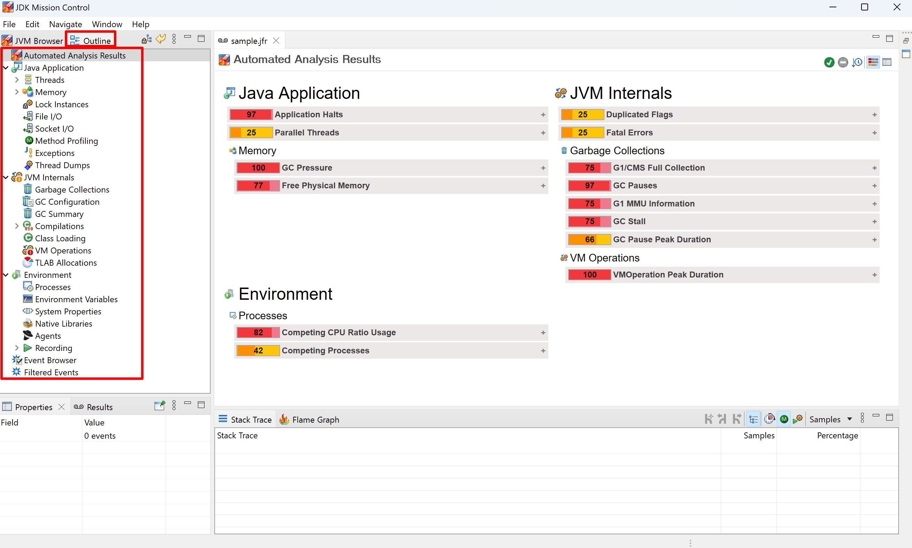

# Analyze a Flight Recording Using JMC

To analyze a flight recording using JMC, this project provides some samples and related docs.

## 1. Concepts

1. **JMC** is short for **JDK Mission Control**, it's a production-time profiling and diagnostics tool. It includes tools to 
   monitor and manage your Java application with a very small performance overhead, and is suitable for monitoring 
   applications running in production. JMC is not part of the regular JDK installation. For more information on JMC 
   downloads and documentation, see [JDK Mission Control Page](https://www.oracle.com/java/technologies/jdk-mission-control.html).
2. **JFR** is short for **Java Flight Recorder**, it's a profiling and event collection framework built into the JDK. allows 
   Java administrators and developers to gather detailed low-level information about how a JVM and Java applications 
   are behaving.
3. **Java Flight Recorder** and **JDK Mission Control** together create a complete tool chain to continuously collect low level 
   and detailed runtime information enabling after-the-fact incident analysis. The tool chain enables developers and 
   administrators to collect and analyze data from Java applications running locally or deployed in production 
   environments.
4. JFR file just like log file of JVM
   1. Diagram of jfr file:
      ```mermaid
      graph LR
          JVM -->|creates| xxx.jfr
          xxx.jfr -->|analyzed by| JMC
      ```
   2. Diagram of application log file:
      ```mermaid
      graph LR
          Application -->|creates| log.text
          log.text -->|analyzed by| LogAnalyzer
      ```

### 2. Samples

1. Each item in the dashboard has a related sample (Not finished all samples yet). Here is the JMC dashboard of 
   analyzing JFR file:
   > 
2. The sample code host in [src/main/java](/src/main/java) folder.
3. The documents host in [docs](docs) folder. 

### 3. Link to each sample's doc

You can click link below to get specific sample's doc.

1. Java Application
   1. [Threads](./docs/Threads.md)
   2. [Memory](./docs/Memory.md)
   3. [Lock Instances](./docs/LockInstances.md)
   4. [File I/O](./docs/FileIO.md)
   5. [Socket I/O](./docs/SocketIO.md)
   6. [Method Profiling](./docs/MethodProfiling.md)
   7. [Exceptions](./docs/Exceptions.md)
   8. Thread Dumps
2. JVM Internals
   1. Garbage Collections
   2. GC Configuration
   3. GC Summary
   4. Compilations
   5. Class Loading
   6. VM Operations
   7. TLAB Allocations
3. Environment
   1. Process
   2. Environment Variables
   3. System Properties
   4. Native Libraries
   5. Agents
   6. Recording
      1. Constant Pools
4. [Event Browser](./docs/EventBrowser.md)

### 4. Reference

1. [Java SE 22 Troubleshooting Guide](https://docs.oracle.com/en/java/javase/22/troubleshoot/index.html)
2. [JDK Mission Control User Guide](https://docs.oracle.com/en/java/java-components/jdk-mission-control/9/user-guide/)

