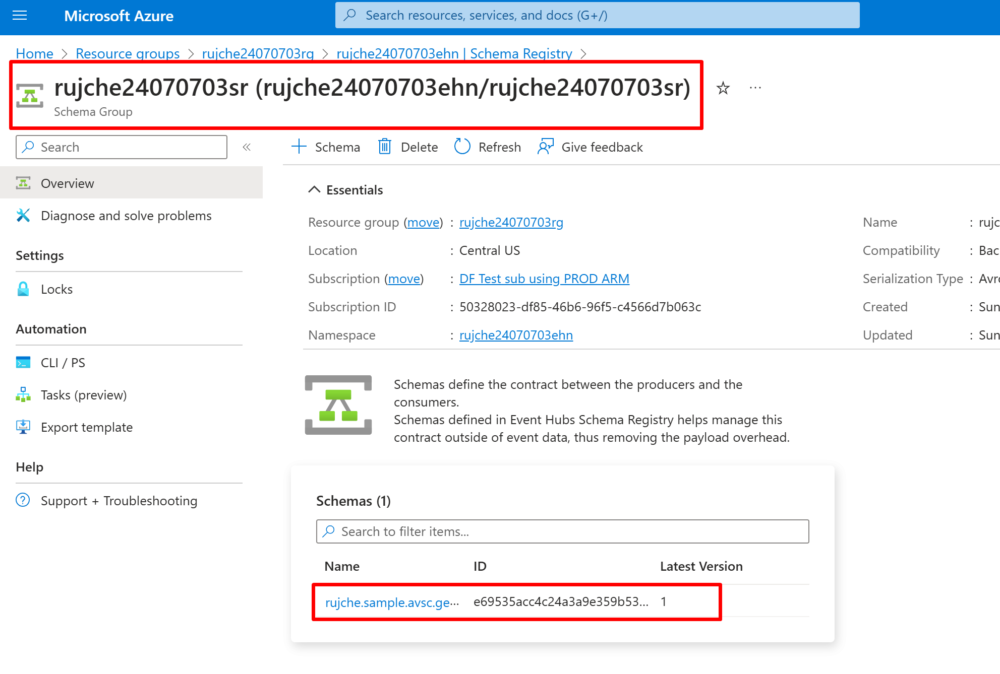

# Use [Azure Schema Registry](https://learn.microsoft.com/en-us/azure/event-hubs/schema-registry-overview) in Spring Boot Application.

This sample is aimed to demonstrate how to use Azure Schema Registry in [Spring Boot](https://spring.io/projects/spring-boot) Application.
The sending and receiving operation is through [spring-kafka](https://spring.io/projects/spring-kafka): 
Send message by `KafkaTemplate`, receive message by `@KafkaListener`.

## 1. How to run the sample

### 1.1. Create azure resources

1. Update these properties in `scripts/variables.sh`.
    ```shell
    export tenant="xxx.onmicrosoft.com"
    export subscription="xxx"
    export location="centralus"
    export resource_name_prefix="xxx"
    ```

2. Run `scripts/create_azure_resources.sh`
   ```shell
   ./scripts/create_azure_resources.sh
   ```

### 1.2. Update `application.yml`

1. Update `application.yml` for local development.

   ```shell
   ./scripts/update_application_yml_for_local_development.sh
   ```

### 1.3. Start `SampleApplication` in IDE

It's just a simple Spring Boot application. You know how to run it in IDE.

### 1.4. Send http request to send message by KafkaTemplate

Use [SampleController.http](scripts/SampleController.http) to send http request by [Intellij IDEA Http Client plugin](https://www.jetbrains.com/help/idea/http-client-in-product-code-editor.html). 
Of course, you can use other tools like curl / Postman as you wish.

### 1.5. Validate the execution result

1. In Run Console, validate there are logs like this:

   ```text
   ...
   ...: Sending message: test-message
   ...
   ...: Received message. topic = rujche24070601eh, message = GenericMessage [payload={"name": "test-message", ...
   ```

2. In Azure Portal, validate corresponding schema has been created.

   > 

## 2. FAQ

### 2.1. Why credential is not necessary when run this application

**Answer**: This is `Passwordless` feature provided by `Spring Cloud Azure`. It's using the credential provided by Azure CLI. 
If you are interested in how it's implemented, you can refer to these codes:
1. [AzureEventHubsKafkaOAuth2AutoConfiguration](https://github.com/Azure/azure-sdk-for-java/blob/a747dd7ab8b9ee8cc6e5a449b557b19536654d8b/sdk/spring/spring-cloud-azure-autoconfigure/src/main/java/com/azure/spring/cloud/autoconfigure/kafka/AzureEventHubsKafkaOAuth2AutoConfiguration.java#L26). 
2. [DefaultAzureCredential](https://github.com/Azure/azure-sdk-for-java/blob/a747dd7ab8b9ee8cc6e5a449b557b19536654d8b/sdk/identity/azure-identity/src/main/java/com/azure/identity/DefaultAzureCredential.java#L101).

## 3. Support

If you have any question about this sample, welcome to [create a GitHub issue](https://github.com/rujche/samples/issues/new).
