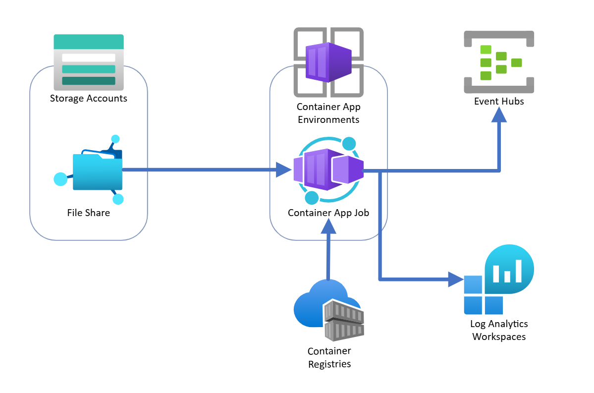
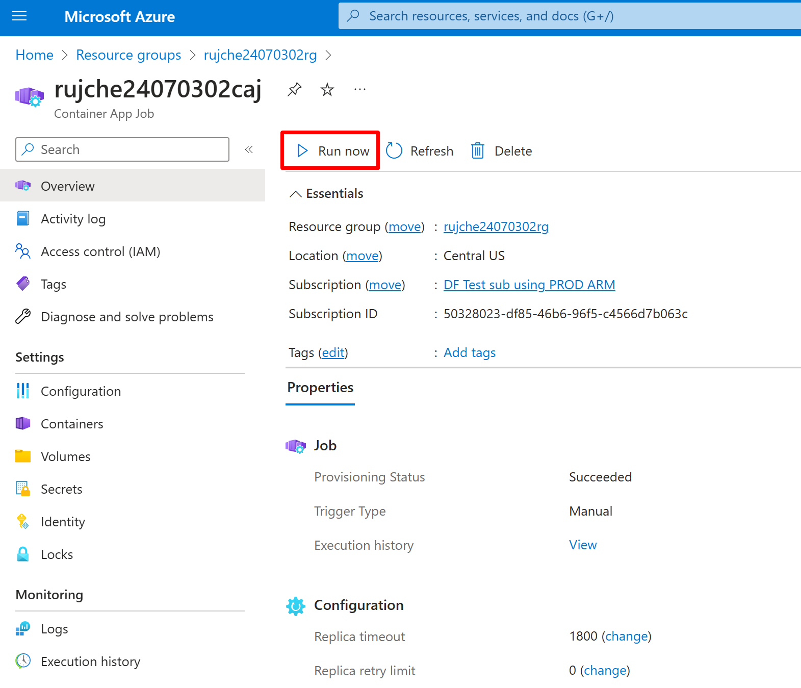

# DevOps Experience of [Azure Container App Job](https://learn.microsoft.com/en-us/azure/container-apps/jobs?tabs=azure-cli)

## 1. Purpose

This sample's purpose is demonstrating the experience of developing and deploying application in Azure Container App job. 
And the application will communicate with other Azure services like [Azure File Share](https://learn.microsoft.com/en-us/azure/storage/files/storage-files-introduction) 
and [Azure Event Hub](https://learn.microsoft.com/en-us/azure/event-hubs/event-hubs-about).

## 2. System diagram

1. System diagram.

   > 

2. System diagram explanation.
   1. The application designed to be run in Container App Job.
   2. The application's main task is to handle text files.
   3. The text files are stored in configured folder in File Share.
   4. After files been handled, they will be moved into another configured folder in the same File Share.
   5. Each valid line of text file will be handled and send to Event Hub.

## 3. How to run this application

### 3.1. Prepare Azure resources

1. Update [variables.sh](./scripts/variables.sh) according to your requirement. These variable should be updated:
   ```shell
   export tenant="example.onmicrosoft.com"
   export subscription="xxxxxxxx-xxxx-xxxx-xxxx-xxxxxxxxxxxx"
   export location="centralus"
   export resource_name_prefix="example"
   ```
2. Enable `prepare_azure_cli_environment` for the first-time run.
   ```shell
   #  Prepare Azure CLI environment only needed for the first time.
   #  prepare_azure_cli_environment "${tenant}"
   ```
3. Create Azure resources.
   ```shell
   ./scripts/create_azure_resources.sh
   ```
   It takes about 10 minutes.

### 3.2. Run this application in localhost

1. Prepare test files.
    ```shell
    ./scripts/restore_test_files.sh
    ```
2. Update `application.yml`.
    ```shell
    ./scripts/update_application_yml_for_local_development.sh
    ```
3. Run this application by IDE. This sample project is just a simple Spring Boot project, you should know how to run it in your IDE.

### 3.3. Run this application in Azure Container App Jobs

1. Build docker image and upload to [Azure Container Registry](https://learn.microsoft.com/en-us/azure/container-registry/):
    ```shell
    ./scripts/build_docker_image.sh
    ```
2. Click `Run now` in [Azure Portal](https://portal.azure.com/) to trigger job execution.

   > 

## 4. Support

If you have any questions, welcome to [crete a GitHub issue](https://github.com/rujche/samples/issues/new).
