# Exceptions

1. What start a recording by JMC, we can see a window like this:
   > 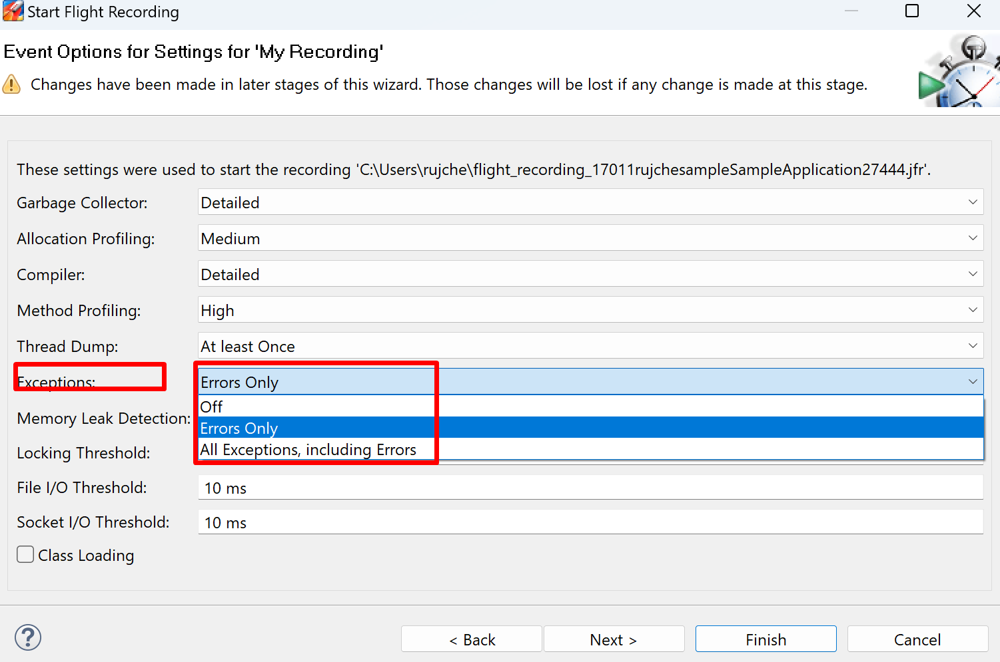
2. We got to know that `Exceptions` in JMC contains 2 parts: Errors and Exceptions.
3. Create `jfr-metadata.text` by command `jfr metadata > jfr-metadata.text`. Then search `Exception` and `Error` in 
   `jfr-metadata.text`, we got 2 related events:
   1. `jdk.JavaExceptionThrow`.
      ```java
      @Name("jdk.JavaExceptionThrow")
      @Label("Java Exception")
      @Category("Java Application")
      @Description("An object derived from java.lang.Exception has been created")
      class JavaExceptionThrow extends jdk.jfr.Event {
        @Label("Start Time")
        @Timestamp("TICKS")
        long startTime;
      
        @Label("Duration")
        @Timespan("TICKS")
        long duration;
      
        @Label("Event Thread")
        @Description("Thread in which event was committed in")
        Thread eventThread;
      
        @Label("Stack Trace")
        @Description("Stack Trace starting from the method the event was committed in")
        StackTrace stackTrace;
      
        @Label("Message")
        String message;
      
        @Label("Class")
        Class thrownClass;
      }
      ```
   2. `jdk.ExceptionStatistics`.
      ```java
      @Name("jdk.ExceptionStatistics")
      @Label("Exception Statistics")
      @Category({"Java Application", "Statistics"})
      @Description("Number of objects derived from java.lang.Throwable that have been created")
      class ExceptionStatistics extends jdk.jfr.Event {
        @Label("Start Time")
        @Timestamp("TICKS")
        long startTime;
      
        @Label("Duration")
        @Timespan("TICKS")
        long duration;
      
        @Label("Event Thread")
        @Description("Thread in which event was committed in")
        Thread eventThread;
      
        @Label("Stack Trace")
        @Description("Stack Trace starting from the method the event was committed in")
        StackTrace stackTrace;
      
        @Label("Exceptions Created")
        long throwables;
      }
      ```
   3. `jdk.JavaErrorThrow`.
      ```java
      @Name("jdk.JavaErrorThrow")
      @Label("Java Error")
      @Category("Java Application")
      @Description("An object derived from java.lang.Error has been created. OutOfMemoryErrors are ignored")
      class JavaErrorThrow extends jdk.jfr.Event {
        @Label("Start Time")
        @Timestamp("TICKS")
        long startTime;
      
        @Label("Duration")
        @Timespan("TICKS")
        long duration;
      
        @Label("Event Thread")
        @Description("Thread in which event was committed in")
        Thread eventThread;
      
        @Label("Stack Trace")
        @Description("Stack Trace starting from the method the event was committed in")
        StackTrace stackTrace;
      
        @Label("Message")
        String message;
      
        @Label("Class")
        Class thrownClass;
      }
      ```
4. The options in JMC configuration page are about `jdk.JavaErrorThrow` and `jdk.JavaExceptionThrow`. Until now, we 
are not sure whether `jdk.ExceptionStatistics` are included in JMC's `Exceptions` page. Let's continue.
5. What's the relationship of `java.lang.Exception`, `java.lang.Throwable` and `java.lang.Error`?
   1. `Throwable`. The Throwable class is the superclass of all errors and exceptions in the Java language. Only 
      objects that are instances of this class (or one of its subclasses) are thrown by the Java Virtual Machine 
      or can be thrown by the Java throw statement. Similarly, only this class or one of its subclasses can be 
      the argument type in a catch clause. For the purposes of compile-time checking of exceptions, Throwable and 
      any subclass of Throwable that is not also a subclass of either RuntimeException or Error are regarded as 
      checked exceptions.
   2. `Exception`. The class Exception and its subclasses are a form of Throwable that indicates conditions that a
      reasonable application might want to catch.
   3. `Error`. An Error is a subclass of Throwable that indicates serious problems that a reasonable application 
      should not try to catch. Most such errors are abnormal conditions.
   4. Here's a simple representation of the exception hierarchy in Java:
      ```text
      Throwable
      |-- Exception (checked)
          |-- IOException (checked)
          |-- SQLException (checked)
          |-- ...
          |-- RuntimeException (unchecked)
              |-- NullPointerException (unchecked)
              |-- IllegalArgumentException (unchecked)
              |-- ...
      |-- Error (unchecked)
          |-- OutOfMemoryError (unchecked)
          |-- StackOverflowError (unchecked)
          |-- ...
      ```
6. Read the java code and think about the expected output.
   ```java
   public class ExceptionsSample {
       private static final Logger LOGGER = LoggerFactory.getLogger(FileIOSample.class);
       public static void main(String[] args) {
           LOGGER.info("main started");
           try {
               throw new Throwable("Test throwable");
           } catch (Throwable throwable) {
               LOGGER.info("Caught throwable");
           }
           try {
               throw new Exception("Test exception");
           } catch (Exception exception) {
               LOGGER.info("Caught exception");
           }
           try {
               throw new RuntimeException("Test runtime exception");
           } catch (RuntimeException exception) {
               LOGGER.info("Caught runtime exception");
           }
           try {
               throw new Error("Test error");
           } catch (Error error) {
               LOGGER.info("Caught error");
           }
           LOGGER.info("main ended");
       }
   }
   ```
7. Run above code with JVM parameter `-XX:StartFlightRecording=duration=30s,filename=sample.jfr`.
8. Check the console output:
   ```text
   [0.718s][info][jfr,startup] Started recording 1. The result will be written to:
   [0.718s][info][jfr,startup] 
   [0.718s][info][jfr,startup] C:\Users\rujche\Work\git-workspace\main\samples\sample.jfr
   14:43:48.382 [main] INFO rujche.sample.jmc.FileIOSample -- main started
   14:43:48.387 [main] INFO rujche.sample.jmc.FileIOSample -- Caught throwable
   14:43:48.388 [main] INFO rujche.sample.jmc.FileIOSample -- Caught exception
   14:43:48.388 [main] INFO rujche.sample.jmc.FileIOSample -- Caught runtime exception
   14:43:48.388 [main] INFO rujche.sample.jmc.FileIOSample -- Caught error
   14:43:48.388 [main] INFO rujche.sample.jmc.FileIOSample -- main ended
   
   Process finished with exit code 0
   ```
9. Open `sample.jfr` by JMC.
   > 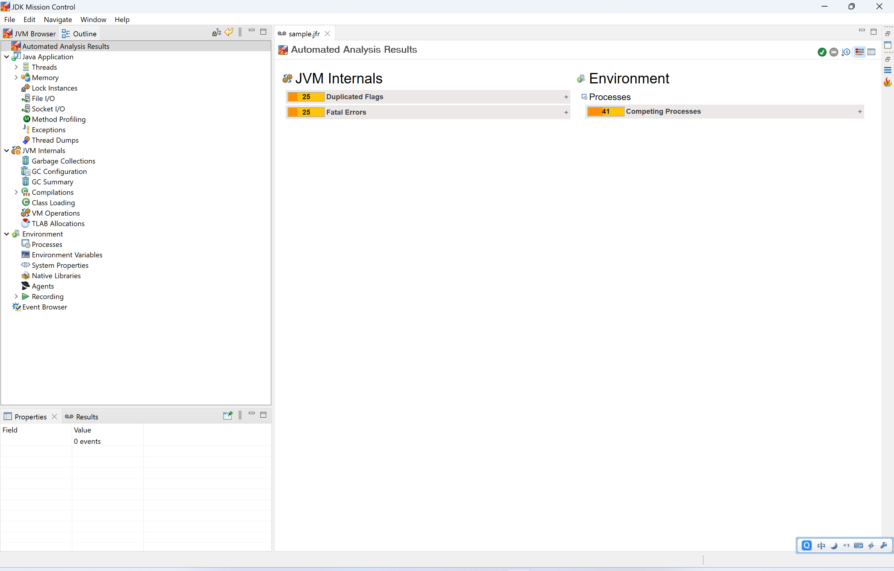
10. Nothing Special in the `Automated Analysis Results` page.
11. Click `Exceptions`.
   > 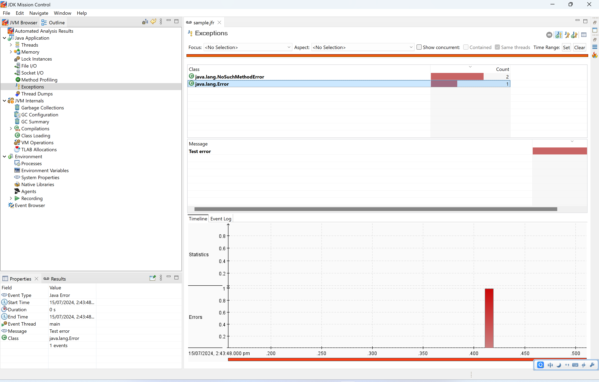
12. There are 2 problems:
    1. Above codes throw 4 throwable, but only one displayed in the board.
    2. `java.lang.NoSuchMethodError` not threw by above codes, where does it come from?
13. Let's solve the problems one by one. First one: Why not all 4 throwable displayed in the board?
14. Open `${JAVA_HOME}/lib/jfr/default.jfc`, get Exception related configuration.
    ```xml
    <configuration>
       <event name="jdk.JavaExceptionThrow">
         <setting name="enabled" control="enable-exceptions">false</setting>
         <setting name="stackTrace">true</setting>
       </event>
       <event name="jdk.JavaErrorThrow">
         <setting name="enabled" control="enable-errors">true</setting>
         <setting name="stackTrace">true</setting>
       </event>
       <event name="jdk.ExceptionStatistics">
         <setting name="enabled">true</setting>
         <setting name="period">1000 ms</setting>
       </event>
    </configuration>
    ```
15. Run above code with JVM parameter `-XX:StartFlightRecording=duration=30s,filename=sample.jfr,jdk.JavaExceptionThrow#enabled=true,jdk.ExceptionStatistics#period=0ns`.
16. Open the new `sample.jfr` by JMC. Click `Exceptions`.
   > 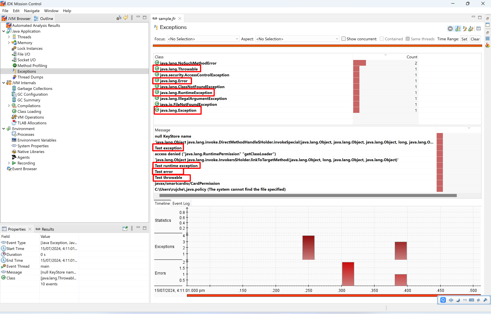
17. The first problem solved. Let's go to next problem: Where is `java.lang.NoSuchMethodError` come from? This time, 
   It has more un-expected `throwable`s.
18. It will be helpful if we can see the stacktrace. Choose related exception, there is no stacktrace displayed.
   > 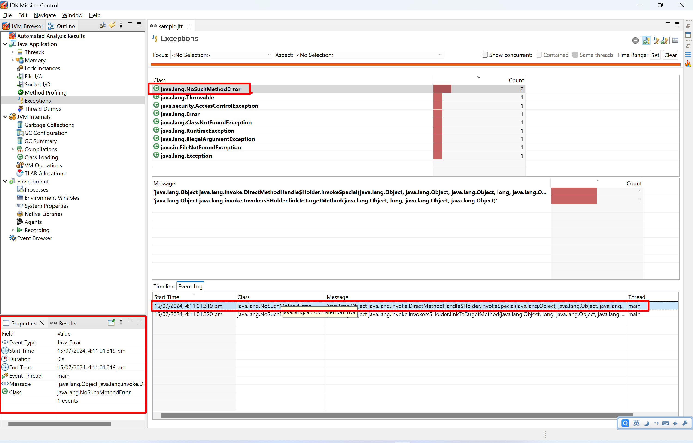
19. Click `Event Browser`, choose related exception, there is no stacktrace either.
   > 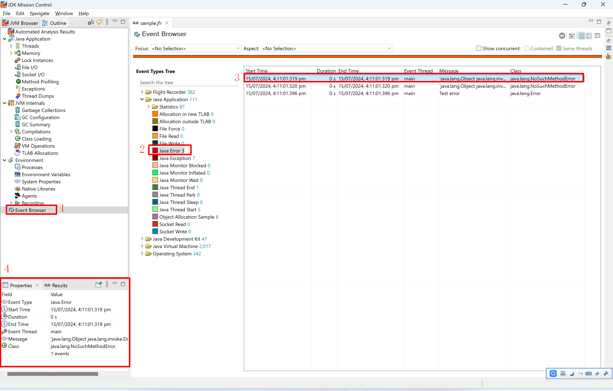
20. Print events to text file by the following command:
   ```shell
   jfr print --stack-depth 100 sample.jfr > sample.jfr.txt
   ```
21. Search `jdk.JavaErrorThrow`. I found the `java.lang.NoSuchMethodError`。
   ```text
   jdk.JavaErrorThrow {
     startTime = 16:11:01.319
     message = "'java.lang.Object java.lang.invoke.Invokers$Holder.linkToTargetMethod(java.lang.Object, long, java.lang.Object, java.lang.Object)'"
     thrownClass = java.lang.NoSuchMethodError (classLoader = bootstrap)
     eventThread = "main" (javaThreadId = 1)
     stackTrace = [
       java.lang.Error.<init>(String) line: 72
       java.lang.LinkageError.<init>(String) line: 55
       java.lang.IncompatibleClassChangeError.<init>(String) line: 54
       java.lang.NoSuchMethodError.<init>(String) line: 57
   ...
       org.slf4j.LoggerFactory.getLogger(Class) line: 447
       rujche.sample.jmc.ExceptionsSample.<clinit>() line: 7
     ]
   }
   ```
22. The stacktrace shows that the error is throw inside SLF4J. Why it throws this error? It's not important in this 
   sample, will not continue investigating it in this doc.
23. Confirmed that all unexpected `jdk.JavaExceptionThrow` and `jdk.JavaErrorThrow` are caused by SLF4J.
24. About show event's stacktrace, Intellij IDEA do better than JMC:
   > 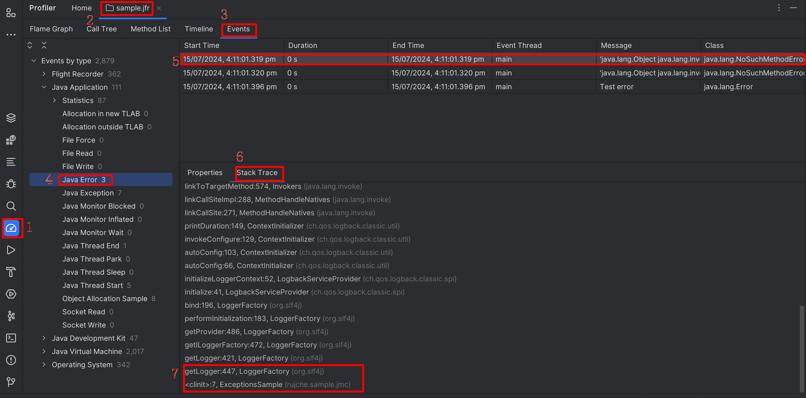
25. Another question: There are 3 events configured in JVM parameter:
    1. `jdk.JavaExceptionThrow`.
    2. `jdk.JavaErrorThrow`.
    3. `jdk.ExceptionStatistics`. 
26. The last one `jdk.ExceptionStatistics` didn't appeared, why?
27. Try to make `jdk.ExceptionStatistics#period` longer, and execution time longer. 
28. Read the java code and think about the expected output.
   ```java
   private static class ExceptionStatisticsSample {
       public static void main(String[] args) {
           LOGGER.info("main started");
           sleepOneSecond();
           throwAndCatch(new Throwable("Test throwable"));
           sleepOneSecond();
           throwAndCatch(new Exception("Test exception"));
           sleepOneSecond();
           throwAndCatch(new RuntimeException("Test runtime exception"));
           sleepOneSecond();
           throwAndCatch(new Error("Test error"));
           sleepOneSecond();
           LOGGER.info("main ended");
       }
       
       private static void sleepOneSecond() {
           try {
               Thread.sleep(1_000);
           } catch (InterruptedException e) {
               LOGGER.info("sleep failed.", e);
           }
       }
       
       private static void throwAndCatch(Throwable throwable) {
           try {
               throw throwable;
           } catch (Throwable t) {
               LOGGER.info("Caught throwable", t);
           }
       }
   }
   ```
29. Run above code with JVM parameter `-XX:StartFlightRecording=duration=30s,filename=sample.jfr,jdk.JavaExceptionThrow#enabled=true,jdk.ExceptionStatistics#period=1000ms`.
30. The console output is absolutely meets expectation.
   ```text
   [0.799s][info][jfr,startup] Started recording 1. The result will be written to:
   [0.799s][info][jfr,startup] 
   [0.799s][info][jfr,startup] C:\Users\rujche\Work\git-workspace\main\samples\sample.jfr
   17:08:03.983 [main] INFO rujche.sample.jmc.FileIOSample -- main started
   17:08:04.991 [main] INFO rujche.sample.jmc.FileIOSample -- Caught throwable
   java.lang.Throwable: Test throwable
       at rujche.sample.jmc.ExceptionsSample$ExceptionStatisticsSample.main(ExceptionsSample.java:38)
   17:08:05.995 [main] INFO rujche.sample.jmc.FileIOSample -- Caught throwable
   java.lang.Exception: Test exception
       at rujche.sample.jmc.ExceptionsSample$ExceptionStatisticsSample.main(ExceptionsSample.java:40)
   17:08:06.997 [main] INFO rujche.sample.jmc.FileIOSample -- Caught throwable
   java.lang.RuntimeException: Test runtime exception
       at rujche.sample.jmc.ExceptionsSample$ExceptionStatisticsSample.main(ExceptionsSample.java:42)
   17:08:07.998 [main] INFO rujche.sample.jmc.FileIOSample -- Caught throwable
   java.lang.Error: Test error
       at rujche.sample.jmc.ExceptionsSample$ExceptionStatisticsSample.main(ExceptionsSample.java:44)
   17:08:09.000 [main] INFO rujche.sample.jmc.FileIOSample -- main ended
   
   Process finished with exit code 0
   ```
31. Confirm that related event created. The quickest way is open by Intellij IDEA directly.
   > 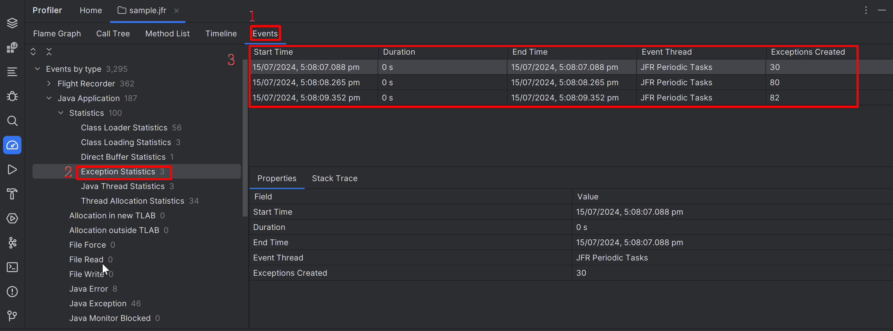
32. Here comes another question: Why so many exceptions? Above codes only created 4. Is it possible to only show 4 
   exceptions in `Exceptions Statics` page?
33. We already know that SLF4J will throw exceptions, let remove SLF4J related code.
   ```java
   public class ExceptionsSampleWithoutLog {
       public static void main(String[] args) {
           sleepOneSecond();
           throwAndCatch(new Throwable("Test throwable"));
           sleepOneSecond();
           throwAndCatch(new Exception("Test exception"));
           sleepOneSecond();
           throwAndCatch(new RuntimeException("Test runtime exception"));
           sleepOneSecond();
           throwAndCatch(new Error("Test error"));
           sleepOneSecond();
       }
   
       private static void sleepOneSecond() {
           try {
               Thread.sleep(1_000);
           } catch (InterruptedException e) {
               System.out.println("sleep failed.");
           }
       }
   
       private static void throwAndCatch(Throwable throwable) {
           try {
               throw throwable;
           } catch (Throwable t) {
               System.out.println("Caught throwable" + throwable.toString());
           }
       }
   }
   ```
34. Run above code with JVM parameter `-XX:StartFlightRecording=duration=30s,filename=sample.jfr,jdk.JavaExceptionThrow#enabled=true,jdk.ExceptionStatistics#period=1000ms`.
35. Open the update `sample.jfr` by Intellij IDEA. Still too many exceptions created.
   > 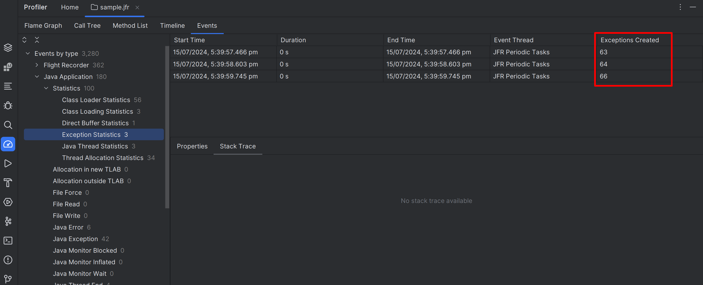
36. Where are these exceptions been created?
   > 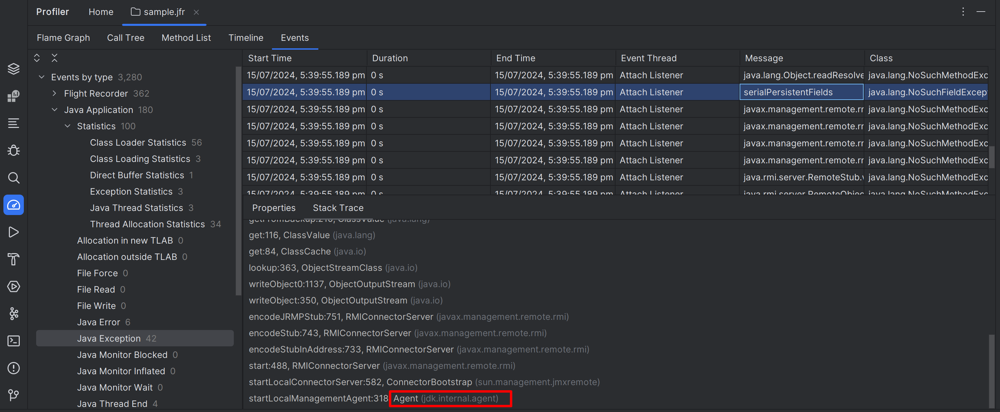
37. Seems a lot of exceptions are created by agent. Where is the agent comes from? Open the `Run` window of Intellij.
   The agent related information displayed in the first line:
   ```text
   "C:\Program Files\Microsoft\jdk-17.0.11.9-hotspot\bin\java.exe" -XX:StartFlightRecording=... "-javaagent:C:\Program Files\JetBrains\IntelliJ IDEA 2024.1.4\lib\idea_rt.jar=63461:C:\Program Files\JetBrains\IntelliJ IDEA 2024.1.4\bin" -Dfile.encoding=UTF-8 -classpath ... rujche.sample.jmc.ExceptionsSampleWithoutLog
   [0.925s][info][jfr,startup] Started recording 1. The result will be written to:
   [0.925s][info][jfr,startup] 
   [0.925s][info][jfr,startup] C:\Users\rujche\Work\git-workspace\main\samples\sample.jfr
   Caught throwable java.lang.Throwable: Test throwable
   Caught throwable java.lang.Exception: Test exception
   Caught throwable java.lang.RuntimeException: Test runtime exception
   Caught throwable java.lang.Error: Test error
   
   Process finished with exit code 0
   ```
38. The agent is added by Intellij IDEA. Let's run the code without Intellij IDEA.
    1. First compile `ExceptionsSampleWithoutLog.java` to `ExceptionsSampleWithoutLog.class`. We can use `javac`, but
       `mvn clean install` will make it easier.
    2. Run the following command.
        ```shell
        java -XX:StartFlightRecording=duration=30s,filename=sample.jfr,jdk.JavaExceptionThrow#enabled=true,jdk.ExceptionStatistics#period=1000ms \
          --class-path ../target/classes \
          rujche.sample.jmc.ExceptionsSampleWithoutLog
        ```
39. Open the new `sample.jfr` by Intellij IDEA. Still many exceptions created by agent, all these exceptions are in one 
   thread named `Attach Listener`.
   > 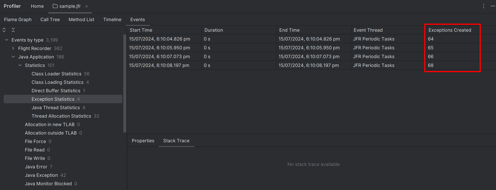
40. I guess the thread named `Attach Listener` was created because of `-XX:StartFlightRecording`. There must be another 
   thread responsible to create the Java Flight Recordings. But How to confirm that? After removing 
   `-XX:StartFlightRecording`, we can't get `sample.jfr`. Without `sample.jfr`, we will not know whether the thread 
   named `Attach Listener` still exists.
41. Here is one solution:
    ```java
        public static class ThreadTest {
            public static void main(String[] args) {
                Set<Thread> threadSet = Thread.getAllStackTraces().keySet();
                for (Thread x : threadSet) {
                    System.out.println(x.getName());
                }
            }
        }
    ```
42. Compile code by `mvn clean install`.
43. Run `.class` by commandline:
    ```shell
    java --class-path target/classes 'rujche.sample.jmc.ExceptionsSampleWithoutLog$ThreadTest'
    ```
44. Here is the output:
    ```text
    $ java --class-path target/classes 'rujche.sample.jmc.ExceptionsSampleWithoutLog$ThreadTest'
    Reference Handler
    Signal Dispatcher
    main
    Attach Listener
    Notification Thread
    Common-Cleaner
    Finalizer
    ```
45. The thread named `Attach Listener` is not created because of `-XX:StartFlightRecording`. Not only `Attach Listener`, 
   there is still many thread except `main`.
46. I found this question in stackoverflow: [Who have created these threads?](https://stackoverflow.com/questions/53813270/who-have-created-these-threads). 
   These threads are created by JVM. More details about these threads is not the key point here, will not continue 
   investigation.
47. Here comes another question: Why Exceptions Created (63,64,66) > Java Error (6) + Java Exception (42) = 48 ?
   > 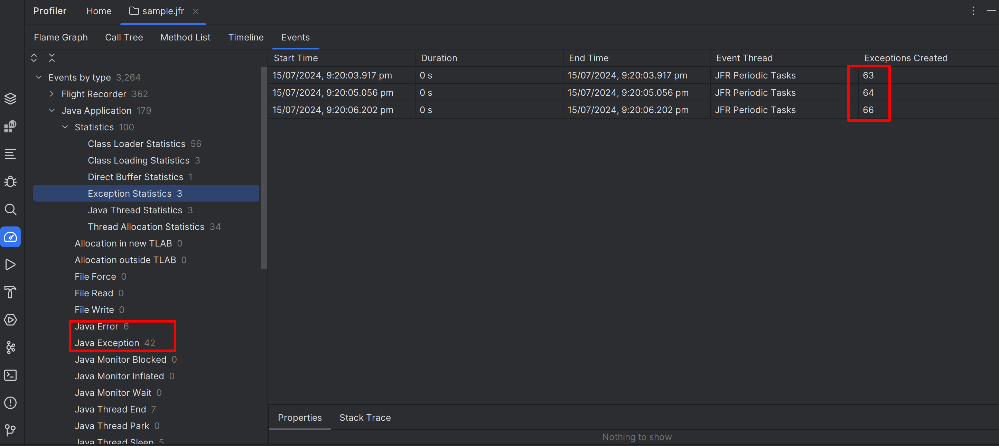
48. To answer this question. Let's review the description of the 3 events:
    1. `jdk.JavaExceptionThrow`: An object derived from java.lang.Exception has been created.
    2. `jdk.JavaErrorThrow`: An object derived from java.lang.Error has been created. OutOfMemoryErrors are ignored.
    3. `jdk.ExceptionStatistics`: Number of objects derived from java.lang.Throwable that have been created.
49. Then review the exception hierarchy in Java:
    ```text
      Throwable
      |-- Exception (checked)
      |-- Error (unchecked)
    ```
50. "Many OutOfMemoryError created" can explain the number. But it can't be. The code didn't consume much memory.
51. Here is my guess that can explain it:
   > 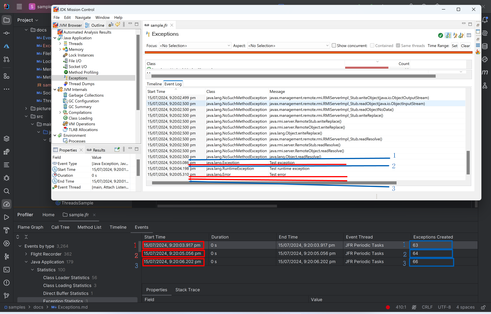
52. Guess:
    1. The red number are the `jdk.ExceptionStatistics` recorded time.
    2. The blue number are the `jdk.ExceptionStatistics` actually analysis time.
    3. Before the first blue number `1`, some exceptions are recorded by `jdk.ExceptionStatistics`, but not corded by
       `jdk.JavaExceptionThrow` or `jdk.ExceptionStatistics`.
53. Let's write code to confirm this.
    ```text
        public static class ExceptionStatisticsAnalysis {
            public static void main(String[] args) {
                sleepWithoutException(10_000);
                throwAndCatch(new Throwable("Test throwable"));
                sleepWithoutException(3_000);
                throwAndCatch(new Exception("Test exception"));
                throwAndCatch(new Exception("Test exception"));
                sleepWithoutException(3_000);
                throwAndCatch(new RuntimeException("Test runtime exception"));
                throwAndCatch(new RuntimeException("Test runtime exception"));
                throwAndCatch(new RuntimeException("Test runtime exception"));
                sleepWithoutException(3_000);
                throwAndCatch(new Error("Test error"));
                throwAndCatch(new Error("Test error"));
                throwAndCatch(new Error("Test error"));
                throwAndCatch(new Error("Test error"));
                sleepWithoutException(3_000);
            }
        }
    ```
54. Run above code with JVM parameter `-XX:StartFlightRecording=duration=30s,filename=sample.jfr,jdk.JavaExceptionThrow#enabled=true,jdk.ExceptionStatistics#period=1000ms`.
   > 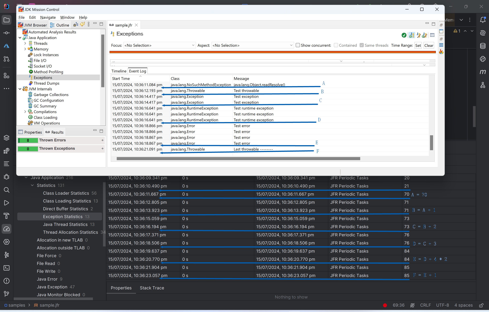
55. The guess already written in the image: 2 Points:
    1. Before the first throwable in our code, some exception recorded by `jdk.ExceptionStatistics`, but not corded by
       `jdk.JavaExceptionThrow` or `jdk.ExceptionStatistics`.
    2. The number recorded by `jdk.JavaExceptionThrow` will multiply 2.
56. To confirm the guess, update the code like this:
    ```java
        public static class ExceptionStatisticsAnalysisTwo {
            public static void main(String[] args) {
                sleepWithoutException(2_000);
                throwAndCatch(new Throwable("First throwable -------- "));
                sleepWithoutException(2_000);
                throwAndCatch(new Throwable("Test throwable"));
                throwAndCatch(new Throwable("Test throwable"));
                throwAndCatch(new Throwable("Test throwable"));
                throwAndCatch(new Throwable("Test throwable"));
                sleepWithoutException(2_000);
                throwAndCatch(new Exception("Test exception"));
                throwAndCatch(new Exception("Test exception"));
                throwAndCatch(new Exception("Test exception"));
                sleepWithoutException(2_000);
                throwAndCatch(new RuntimeException("Test runtime exception"));
                throwAndCatch(new RuntimeException("Test runtime exception"));
                sleepWithoutException(2_000);
                throwAndCatch(new Error("Test error"));
                sleepWithoutException(2_000);
                throwAndCatch(new Throwable("Last throwable -------- "));
                sleepWithoutException(2_000);
            }
        }
    ```
57. Run above code again.
   > 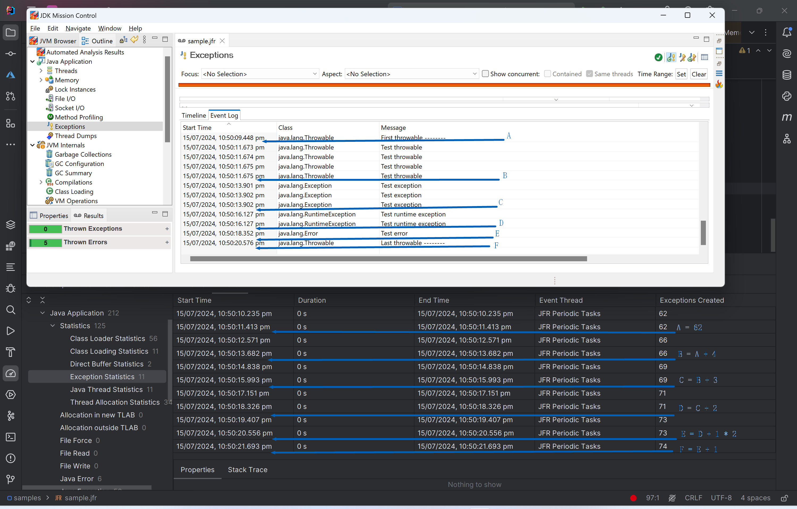
58. Confirmed the 2 Points are right. The reason is unknown now.
59. Another thing: In Intellij IDEA event browser, the `Duration` is `0` and `End Time` is equal to `Start Time`. It's 
   misleading information. Actually, there is no `endTime` in `sample.jfr.text`. Similar problem also exists in JMC.
   > 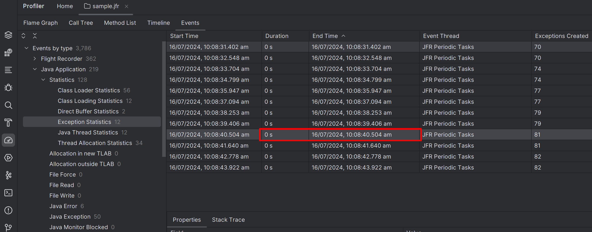
   > 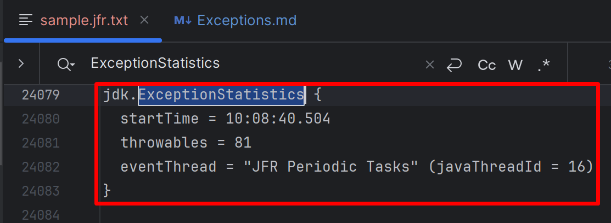


