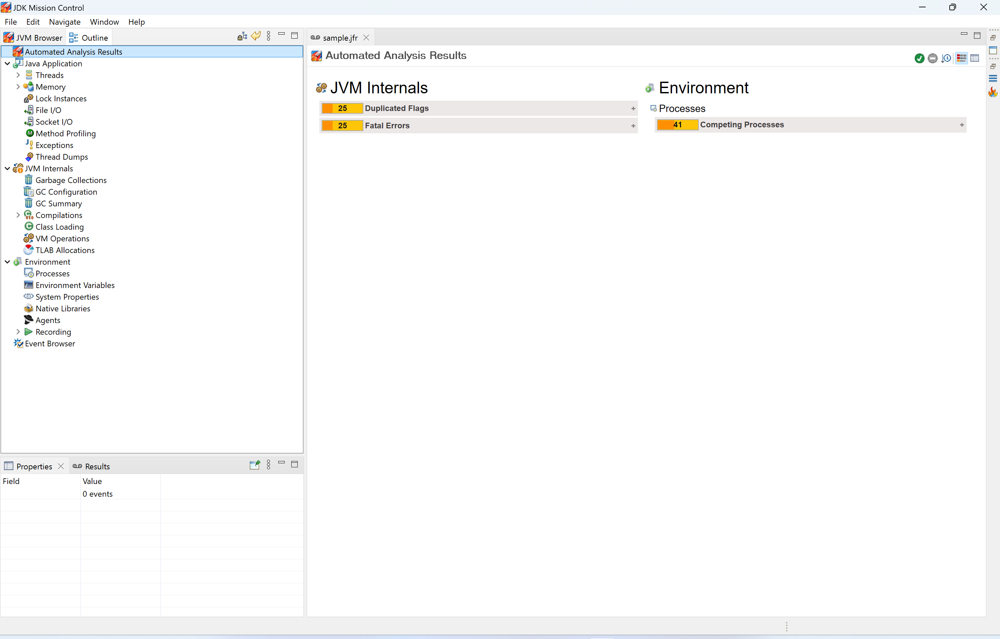
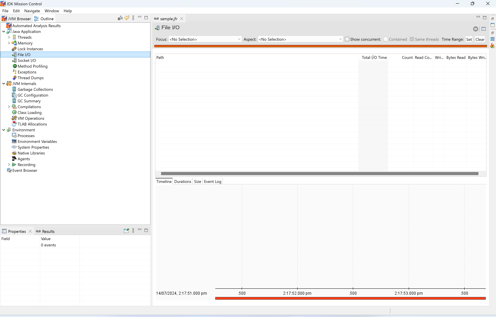
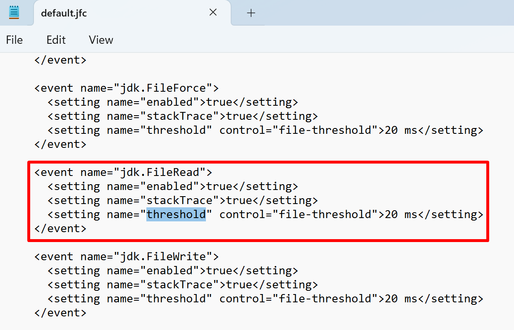
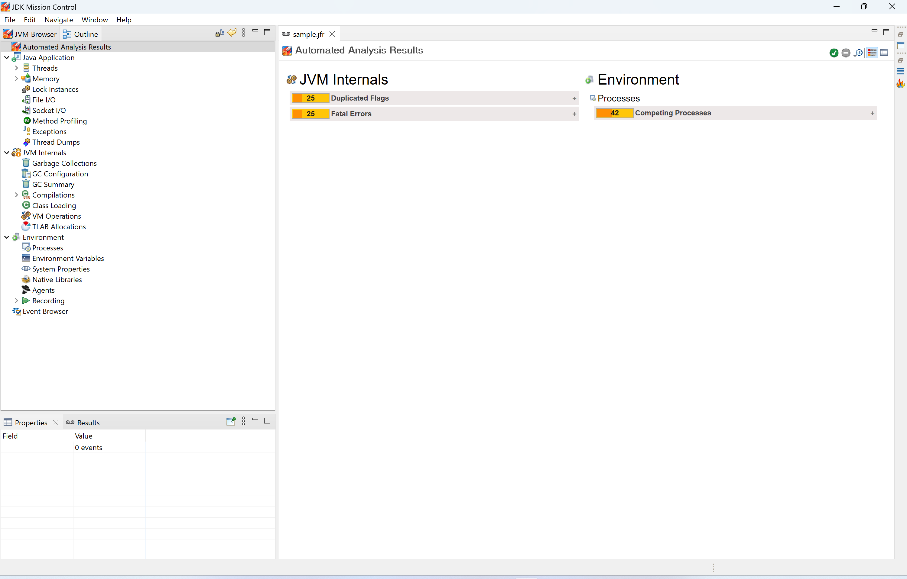
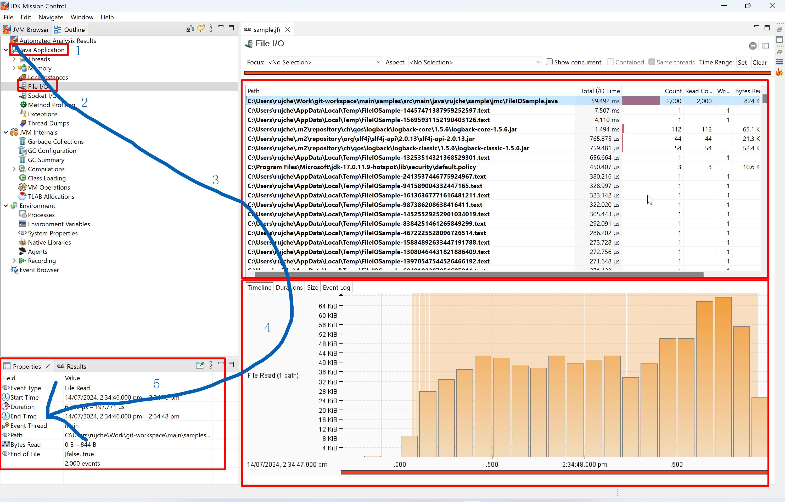

# File I/O

Just following the steps below one by one to learn about the basic usage of related feature in JMC.

1. Read the java code and think about the expected output.
    ```java
    public class FileIOSample {
        private static final Logger LOGGER = LoggerFactory.getLogger(FileIOSample.class);
        private static final String FILE_NAME = "src/main/java/rujche/sample/jmc/FileIOSample.java";
    
        public static void main(String[] args) throws IOException {
            LOGGER.info("main started");
            for (int i = 0; i < 1_000; i++) {
                byte[] data = Files.readAllBytes(Paths.get(FILE_NAME));
                File file = File.createTempFile("FileIOSample-", ".text");
                Files.write(file.toPath(), data);
                file.deleteOnExit();
            }
            LOGGER.info("main ended.");
        }
    }
    ```
2. Run the code with JVM parameter `-XX:StartFlightRecording=duration=30s,filename=sample.jfr`.
3. Open `sample.jfr` by JMC.
   > 
4. There is no FileIO related information in the `Automated Analysis Result` page. Click `File I/O`.
   > 
5. No File I/O related events, why?
6. After short-time investigation, I found the reason: The default threshold is 20 ms, the events created by above code 
   are less than 20 ms. 
7. Update the threshold by VM parameter.

   | NO.        | VM parameter                                                                                                     |
   |------------|------------------------------------------------------------------------------------------------------------------|
   | 1          | -XX:StartFlightRecording=duration=30s,filename=sample.jfr                                                        |
   | 2          | -XX:StartFlightRecording=duration=30s,filename=sample.jfr,jdk.FileRead#threshold=0ns,jdk.FileWrite#threshold=0ns |
8. Note that it should be `jdk.FileRead#threshold`, not `jdk.FileRead.threshold`.
9. All supported parameters and default value can be found in `${JAVA_HOME}/lib/jfr/default.jfc`.
   > 
10. Use the new JVM parameter create a new `sample.jfr`, open it by JMC.
   > 
11. Click `File I/O`.
   > 
12. We found that the scope of events narrow down in an order like a right bracket: `)`.


