# Lock Instances

Just following the steps below one by one to learn about the basic usage of related feature in JMC.

1. Go through the steps in [Threads.md](Threads.md) to get a jfr file and open it in JMC.
2. Click `Lock Instances`.
   > 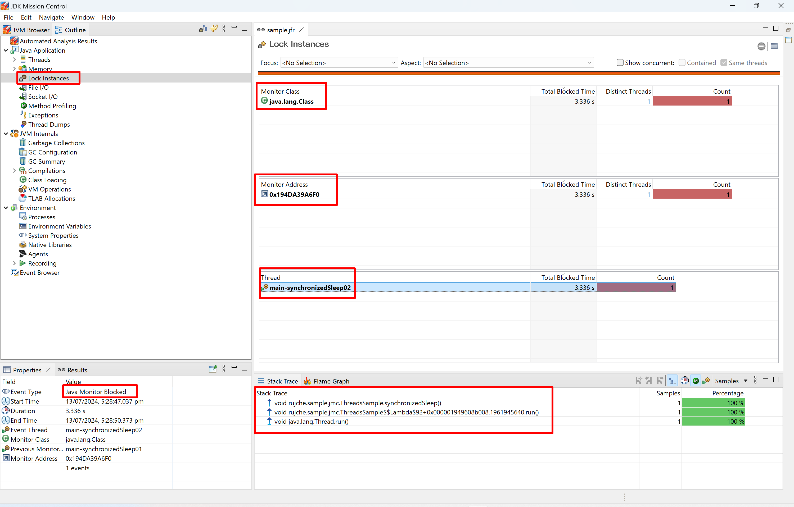
3. This scenario is simple:
   1. One Monitor class.
   2. One Monitor address.
   3. One Thread been blocked.
   4. One related event.
4. Let's create a deadlock sample.
   ```java
   public class LockInstancesSample {
       private static final Logger LOGGER = LoggerFactory.getLogger(LockInstancesSample.class);
   
       public static void main(String[] args) {
           LOGGER.info("main started.");
           ResourceA resourceA = new ResourceA();
           ResourceB resourceB = new ResourceB();
           Runnable runnableA = () -> {
               LOGGER.info("runnableA started.");
               synchronized (resourceA) {
                   LOGGER.info("runnableA locked resourceA.");
                   try {
                       Thread.sleep(100);
                   } catch (InterruptedException e) {
                       LOGGER.error("runnableA interrupted.", e);
                   }
                   synchronized (resourceB) {
                       LOGGER.info("runnableA locked both resourceA and resourceB.");
                   }
                   LOGGER.info("runnableA unlocked resourceB.");
               }
               LOGGER.info("runnableA unlocked resourceA.");
               LOGGER.info("runnableA ended.");
           };
           Runnable runnableB = () -> {
               LOGGER.info("runnableB started.");
               synchronized (resourceB) {
                   LOGGER.info("runnableB locked resourceB.");
                   try {
                       Thread.sleep(100);
                   } catch (InterruptedException e) {
                       LOGGER.error("runnableB interrupted.", e);
                   }
                   synchronized (resourceA) {
                       LOGGER.info("runnableB locked both resourceA and resourceB.");
                   }
                   LOGGER.info("runnableB unlocked resourceA.");
               }
               LOGGER.info("runnableB unlocked resourceB.");
               LOGGER.info("runnableB ended.");
           };
           Thread threadA = new Thread(runnableA, "runnableA");
           Thread threadB = new Thread(runnableB, "runnableB");
           threadA.start();
           threadB.start();
           try {
               Thread.sleep(10_000);
           } catch (InterruptedException e) {
               LOGGER.error("main interrupted.", e);
           }
           LOGGER.info("Prepare to interrupt threadA and threadB.");
           threadA.interrupt();
           threadB.interrupt();
           LOGGER.info("main ended.");
       }
   
       private static class ResourceA {
       }
   
       private static class ResourceB {
       }
   }
   ```
5. Run the code with JVM parameter `-XX:StartFlightRecording=duration=30s,filename=sample.jfr`.
6. Use JMC open `sample.jfr`. Nothing special in `Automaticated Analysis Result`page:
   > 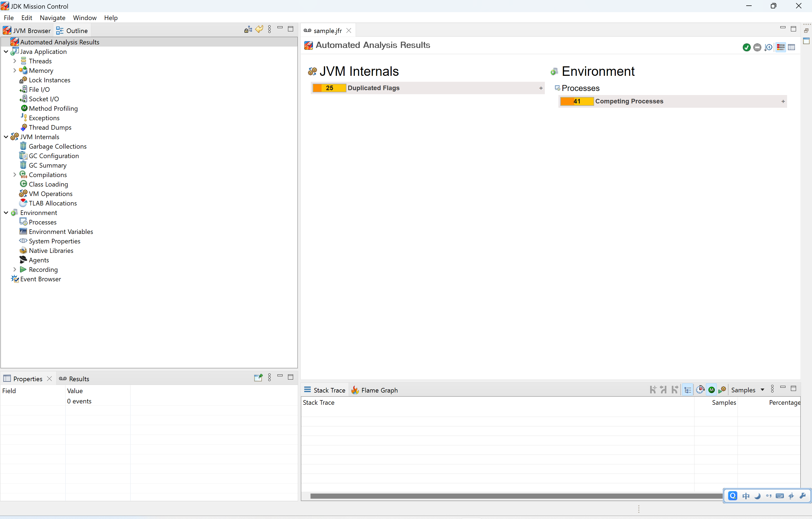
7. Click `Lock Instances`. There is no lock instance. This doesn't meet my expectation. In my expectation, there should 
   be 2 locks here.
   > 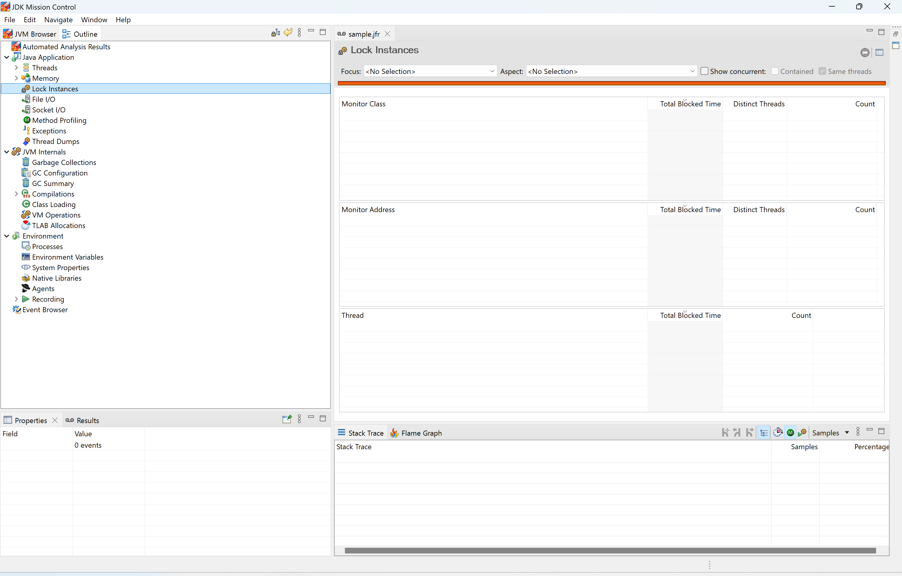
8. Click `Thread Dumps`, we can see the information of deadlock:
   > 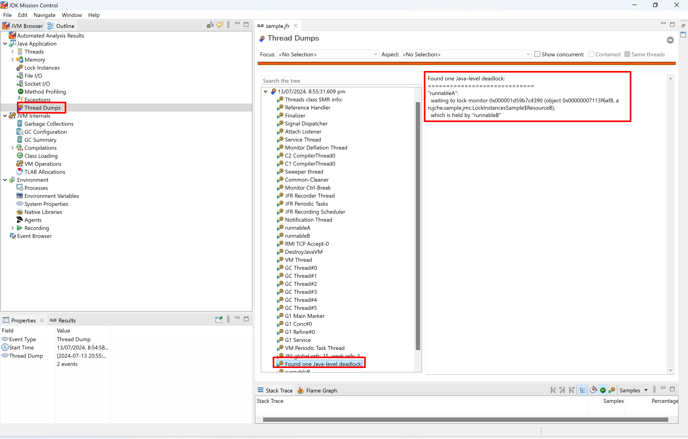
   > 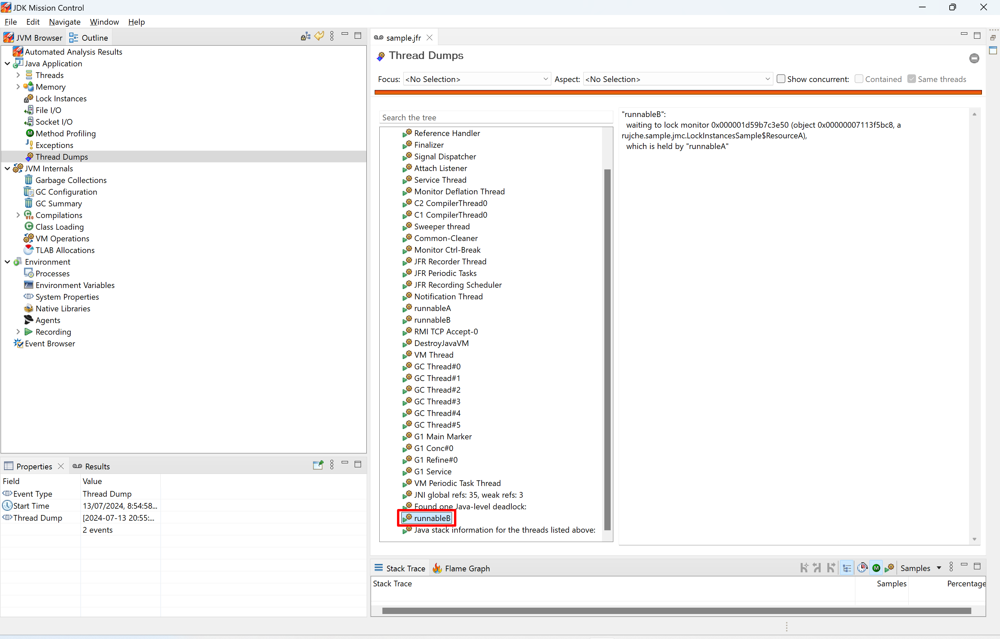
9. Let print the jfr file and check the original information in JFR file:
   ```shell
   jfr print sample.jfr > sample.jfr.txt
   ```
10. Search `deadlock` in `sample.jfr.text`:
   > 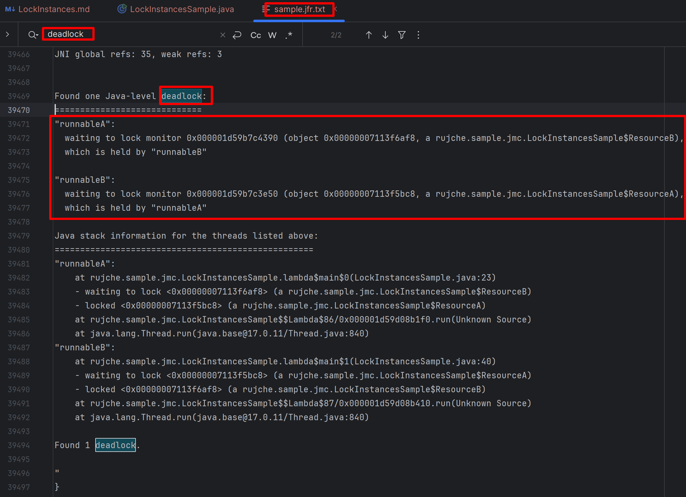
11. In JMC UI, the 2 entries (`Found 1 Java-level deadlock:` and `runnableB`) should be one entry.
   > 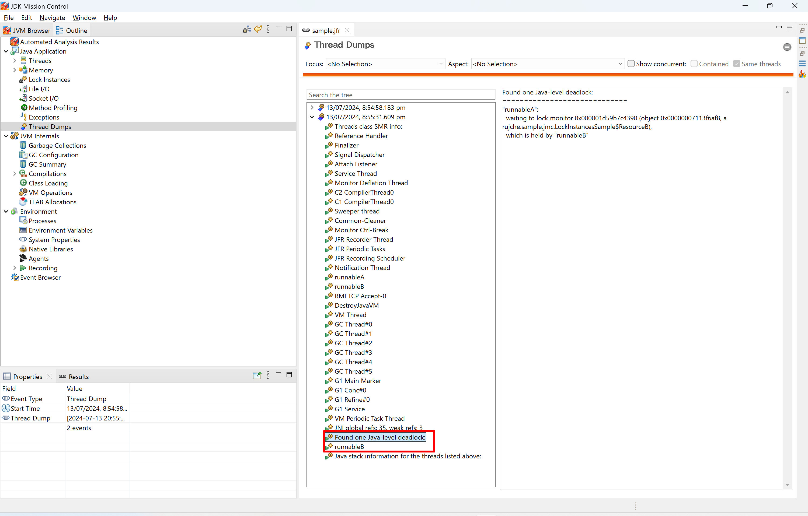
12. Now we have this question: Why there is no lock instance in the `Lock Instances` page?
13. First let's find the event type by run the sample in [Threads.md](Threads.md).
   > 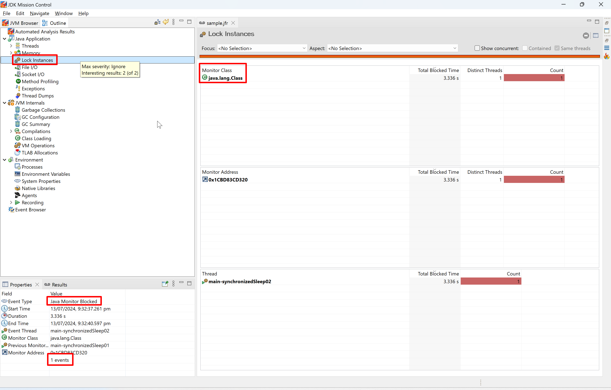
14. We got to know that the locks displayed in the `Lock Instance` comes from `Java Monitor Blocked` event.
15. Search `Java Monitor Blocked` in `sample.jfr.text`, and find nothing. I'm sure block indeed happened. but why the 
   event not exist?
16. I tried to add `jdk.JavaMonitorEnter#threshold=1ms` in JVM parameter like this: 
   `-XX:StartFlightRecording=duration=30s,filename=sample.jfr,jdk.JavaMonitorEnter#threshold=1ms`, but failed.
    `Java Monitor Blocked` event still not appeared in `sample.jfr.text`.
17. Maybe we can find some hint in the metadata. First print the metadata:
   ```shell
   jfr metadata > jfr-metadata.text
   ```
18. Search `Java Monitor Blocked` in `jfr-metadata.text` and found this:
   > 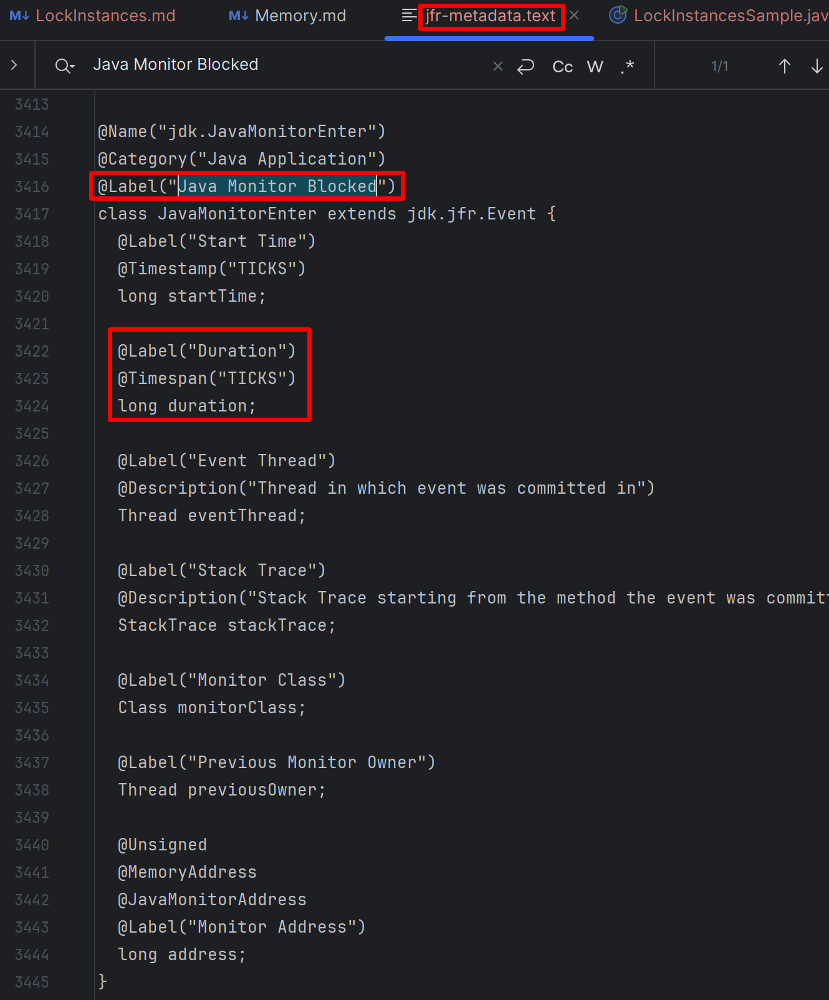
19. To get `duration`, the event need to be recorded at the end of block, i.e. recorded the block event when unblocked. 
   Deadlock will never unblock, so there is no event recorded.
20. To test this guess, change code like this:
   ```java
   private static class TestRecordBlockEventWhenUnblocked {
      public static void main(String[] args) {
         LOGGER.info("main started.");
         ResourceA resourceA = new ResourceA();
         Runnable runnableA = () -> {
            LOGGER.info("runnableA started.");
            synchronized (resourceA) {
               LOGGER.info("runnableA locked resourceA.");
               try {
                  Thread.sleep(13_000);
               } catch (InterruptedException e) {
                  LOGGER.error("runnableA interrupted.", e);
               }
               LOGGER.info("runnableA unlocked resourceB.");
            }
            LOGGER.info("runnableA ended.");
         };
         Runnable runnableB = () -> {
            LOGGER.info("runnableB started.");
            synchronized (resourceA) {
               LOGGER.info("runnableB locked resourceA.");
               try {
                  Thread.sleep(13_000);
               } catch (InterruptedException e) {
                  LOGGER.error("runnableB interrupted.", e);
               }
               LOGGER.info("runnableB unlocked resourceA.");
            }
            LOGGER.info("runnableB ended.");
         };
         Thread threadA = new Thread(runnableA, "runnableA");
         Thread threadB = new Thread(runnableB, "runnableB");
         threadA.start();
         threadB.start();
         LOGGER.info("main ended.");
      }
   }
   ```
21. Open `sample.jfr`:
   > 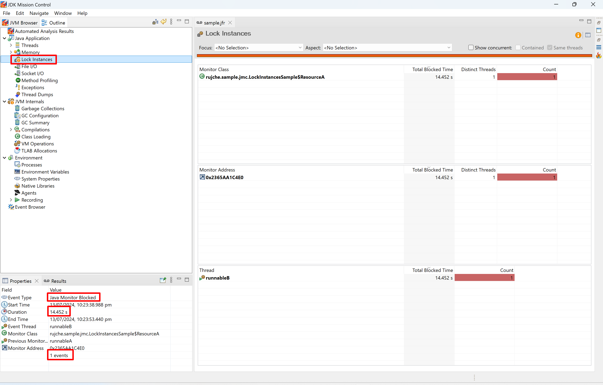
22. There is one `Java Monitor Blocked` event, and duration is about 14 seconds. This meets my expectation.
23. `Java Monitor Blocked` event was recorded when unblocked to get the information of duration, deadlock will never 
   unblock, so there is no `Java Monitor Blocked` event. This can explain all we have experienced.
24. Create a sample to check multi-lock scenario:
   ```java
   private static class MultiThreadLockOnOneObject {
       public static void main(String[] args) {
           LOGGER.info("main started.");
           ResourceA resourceA = new ResourceA();
           ResourceB resourceB = new ResourceB();
           List<Thread> threads = new ArrayList<>();
           for (int i = 0; i < 10; i++) {
               threads.add(new Thread(createRunnable(resourceA), "thread-a-" + i));
               threads.add(new Thread(createRunnable(resourceB), "thread-b-" + i));
           }
           for (Thread thread : threads) {
               thread.start();
           }
           LOGGER.info("main ended.");
       }
   
       private static Runnable createRunnable(Object object) {
           return () -> {
               synchronized (object) {
                   try {
                       Thread.sleep(2_000);
                   } catch (InterruptedException e) {
                       LOGGER.error("runnable interrupted.", e);
                   }
               }
           };
       }
   }
   ```
25. Open `sample.jfr`, the `Automated Analysis Result` give accurate analysis:
   > 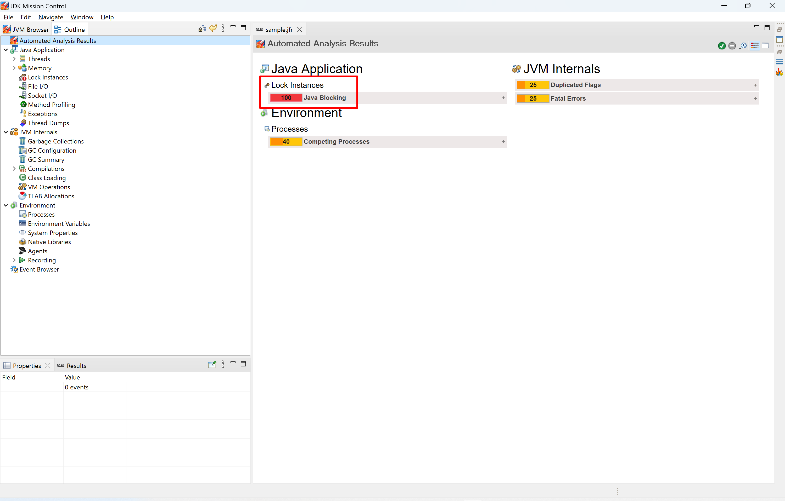
26. Click `Lock Instances`.
   > 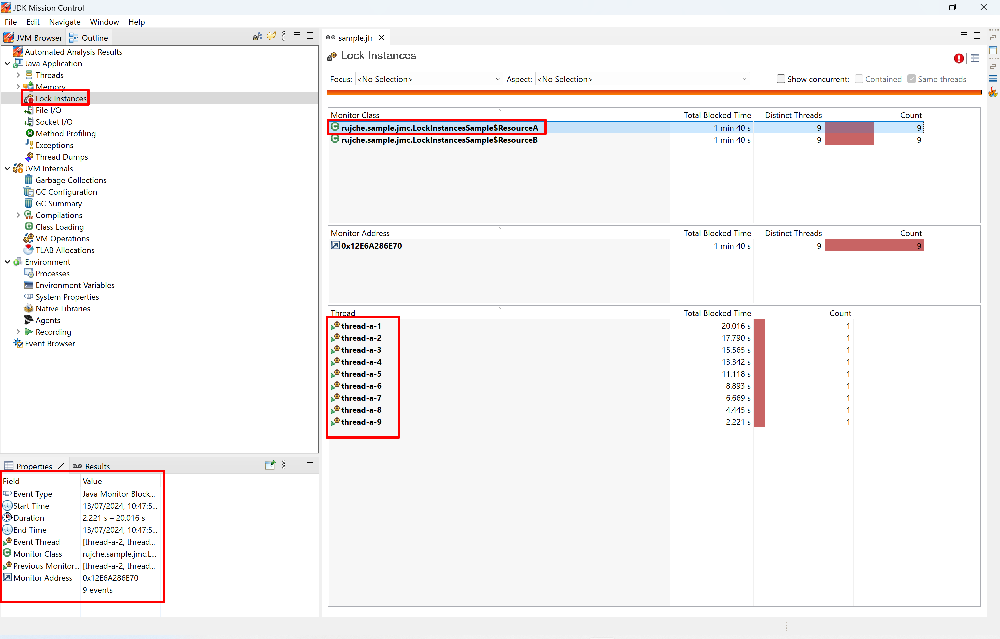
   > 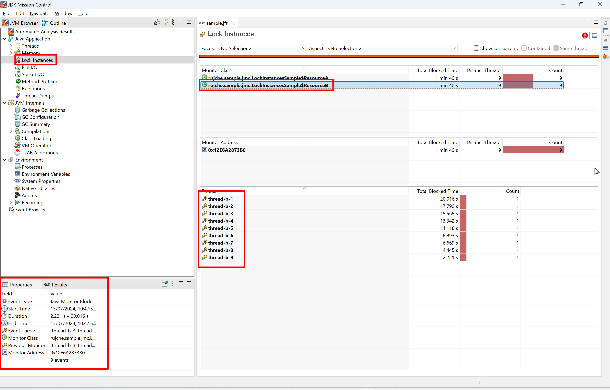
27. Click `Threads`.
   > 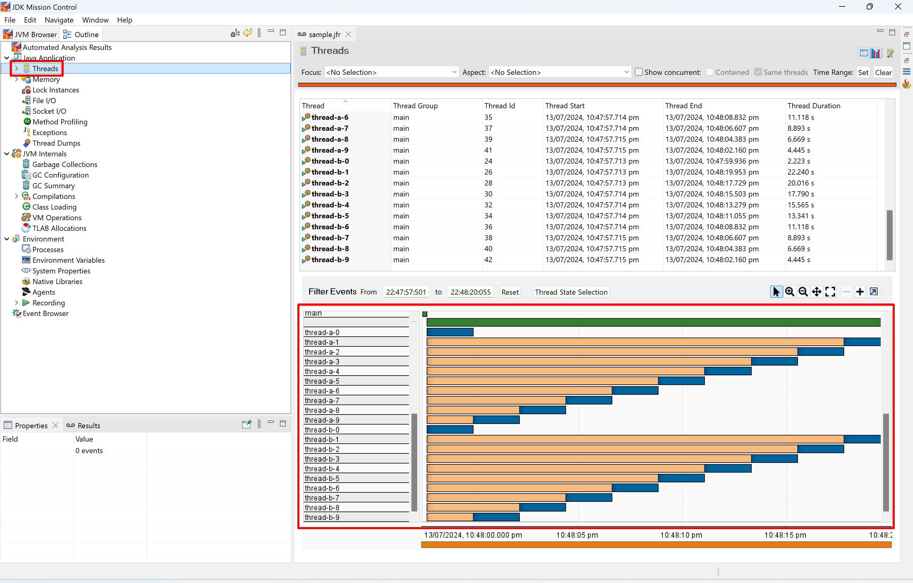
28. Not important. I found one small bug in JMC:
   > 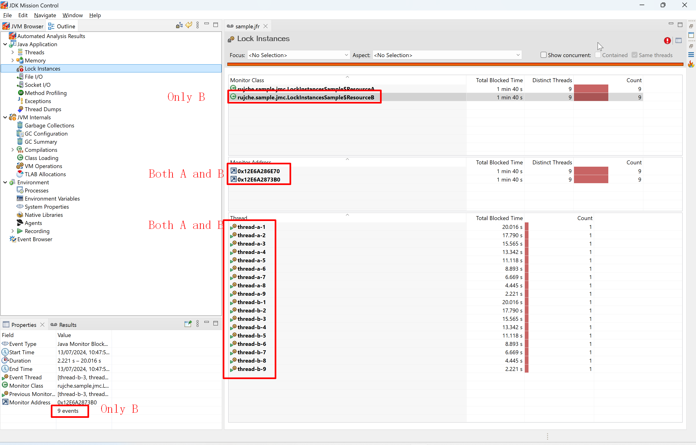


