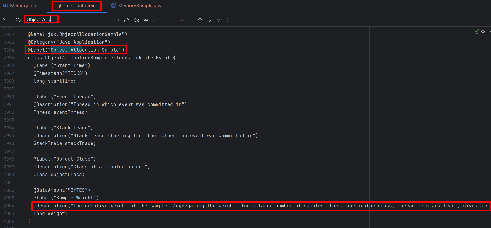

# Memory

Just following the steps below one by one to learn about the basic usage of related feature in JMC.

1. Read the java code and think about the expected output.
    ```java
    public class MemorySample {
    private static final Logger LOGGER = LoggerFactory.getLogger(MemorySample.class);
    
        public static void main(String[] args) {
            LOGGER.info("main started.");
            List<Object> list = new ArrayList<>();
            try {
                while (true) {
                    list.add(new Object());
                }
            } catch (OutOfMemoryError e) {
                LOGGER.info("OutOfMemoryError happened as expected. list.size() = {}.", list.size(), e);
            }
            try {
                Thread.sleep(1_000);
            } catch (InterruptedException e) {
                LOGGER.error("Sleep failed", e);
            }
            LOGGER.info("main ended.");
        }
    }
    ```
2. Run the code with JVM parameter `-XX:StartFlightRecording=duration=30s,filename=sample.jfr`.
3. Check the output log. Does it meet with your expectation? Here is the log in my side:
   ```text
   [0.841s][info][jfr,startup] Started recording 1. The result will be written to:
   [0.841s][info][jfr,startup] 
   [0.841s][info][jfr,startup] C:\Users\rujche\Work\git-workspace\main\samples\sample.jfr
   14:20:48.665 [main] INFO rujche.sample.jmc.MemorySample -- main started.
   14:21:05.011 [main] INFO rujche.sample.jmc.MemorySample -- OutOfMemoryError happened as expected. list.size() = 157704907.
   java.lang.OutOfMemoryError: Java heap space
     at java.base/java.util.Arrays.copyOf(Arrays.java:3481)
     at java.base/java.util.ArrayList.grow(ArrayList.java:237)
     at java.base/java.util.ArrayList.grow(ArrayList.java:244)
     at java.base/java.util.ArrayList.add(ArrayList.java:454)
     at java.base/java.util.ArrayList.add(ArrayList.java:467)
     at rujche.sample.jmc.MemorySample.main(MemorySample.java:17)
   14:21:06.036 [main] INFO rujche.sample.jmc.MemorySample -- main ended.
   ```
4. Open `sample.jfr` by JMC.
   > 
5. The `Automated Analysis Result` was displayed by default. The given result is accurate: `Memory` / `GC Pressure`.
6. Click `Memory` and analyze by the board.
   > 
7. Let's calculate the `Object`'s size by existing information.
   1. Get total size from JMC. totalSize = 2458623160
      > 
   2. Get count from log. count = 157704907
      ```text
      OutOfMemoryError happened as expected. list.size() = 157704907
      ```
   3. Calculate each Object's size. averageSize = totalSize / count = 2458623160 / 157704907 = 15.59.
8. It's strange, let's change the objectCount and get more data.
9. Write code like this:
   ```java
   private static class MemoryAnalysis {
      public static void main(String[] args) {
         LOGGER.info("main started.");
         List<MemoryAnalysis> list = new ArrayList<>();
         try {
            for (int i = 0; i < 10_000_000; i++) {
               list.add(new MemoryAnalysis());
            }
         } catch (OutOfMemoryError e) {
            LOGGER.info("OutOfMemoryError happened. list.size() = {}.", list.size(), e);
         }
         try {
            Thread.sleep(1_000);
         } catch (InterruptedException e) {
            LOGGER.error("Sleep failed", e);
         }
         LOGGER.info("main ended.");
      }
   }
   ```
10. Try different count, and summarize the result in table.

   | count        | totalSize (Byte) | averageSize (Byte) |
   |--------------|------------------|--------------------|
   | 100_000      | 2_514_856        | 25.1               |
   | 1_000_000    | 17_818_352       | 17.8               |
   | 10_000_000   | 169_312_784      | 16.9               |
   | 100_000_000  | 1_559_863_784    | 15.6               |
11. Seems when the count comes bigger, the averageSize become smaller. But why?
12. Write code to analyze the memory of a class with no fields:
   ```java
   private static class MemoryAnalysisTwo {
     public static void main(String[] args) {
         System.out.println("======================================================================");
         System.out.println("--------------------------------------");
         System.out.println(ClassLayout.parseClass(MemoryAnalysisTwo.class).toPrintable());
         System.out.println("--------------------------------------");
         MemoryAnalysisTwo memoryAnalysisTwo = new MemoryAnalysisTwo();
         System.out.println("VM.current().sizeOf(memoryAnalysisTwo):\n" + VM.current().sizeOf(memoryAnalysisTwo));
         System.out.println("--------------------------------------");
         System.out.println("GraphLayout.parseInstance(memoryAnalysisTwo).toFootprint():\n" + GraphLayout.parseInstance(memoryAnalysisTwo).toFootprint());
     }
   }
   ```
13. Run above code and analyze the output:
   ```text
   ======================================================================
   --------------------------------------
   # WARNING: Unable to get Instrumentation. Dynamic Attach failed. You may add this JAR as -javaagent manually, or supply -Djdk.attach.allowAttachSelf
   # WARNING: Unable to attach Serviceability Agent. sun.jvm.hotspot.memory.Universe.getNarrowOopBase()
   rujche.sample.jmc.MemorySample$MemoryAnalysisTwo object internals:
   OFFSET  SIZE   TYPE DESCRIPTION                               VALUE
   0    12        (object header)                           N/A
   12     4        (loss due to the next object alignment)
   Instance size: 16 bytes
   Space losses: 0 bytes internal + 4 bytes external = 4 bytes total
      
   --------------------------------------
   VM.current().sizeOf(memoryAnalysisTwo):
   16
   --------------------------------------
   GraphLayout.parseInstance(memoryAnalysisTwo).toFootprint():
   rujche.sample.jmc.MemorySample$MemoryAnalysisTwo@1d251891d footprint:
   COUNT       AVG       SUM   DESCRIPTION
   1        16        16   rujche.sample.jmc.MemorySample$MemoryAnalysisTwo
   1                  16   (total)
   ```
14. Seems an object with no fields should occupy 16 bytes. But how to explain above table?
15. Let's continue investigating above memory occupation by heap dump.
16. Write code like this:
   ```java
   private static class MemoryAnalysisByHeapDump {
      public static void main(String[] args) {
          LOGGER.info("main started.");
          List<MemoryAnalysisByHeapDump> list = new ArrayList<>();
          try {
              for (int i = 0; i < 100_000; i++) {
                  list.add(new MemoryAnalysisByHeapDump());
              }
          } catch (OutOfMemoryError e) {
              LOGGER.info("OutOfMemoryError happened. list.size() = {}.", list.size(), e);
          }
          LOGGER.info("Start sleep. Please create heap dump now.");
          try {
              Thread.sleep(100_000);
          } catch (InterruptedException e) {
              LOGGER.error("Sleep failed", e);
          }
      }
   }
   ```
17. Start above code, there should be output like this:
   ```text
   15:38:07.217 [main] INFO rujche.sample.jmc.MemorySample -- main started.
   15:38:07.229 [main] INFO rujche.sample.jmc.MemorySample -- Start sleep. Please create heap dump now.
   ```
18. When it's sleeping, create heap dump file by JMC:
   > 
19. After heap dump file created, it will be opened by JMC automatically:
   > 
20. Check the memory for `MemoryAnalysisByHeapDump` class by JMC:
   > 
21. averageSize = totalSize / count = 1_600_000 / 100_000 = 16. Looks good. But how to explain the memory in JMC 
    Flight Record page?
22. Find related event in JMC.
   > 
23. Create JFR metadata file:
   ```shell
   jfr metadata > jfr-metadata.text
   ```
24. Find related event `Object Allocation Sample` in `jfr-metadata.text`:
   > 
25. It saied `The relative weight of the sample. Aggregating the weights for a large number of samples, for a 
   particular class, thread or stack trace, gives a statistically accurate representation of the allocation 
   pressure`. Not each creation operation will create an event. Let's confirm that in the JFR file.
26. Print JFR file to text file:
   ```shell
   jfr print sample.jfr > sample.jfr.txt
   ```
27. Search `jdk.ObjectAllocationSample` in `sample.jfr.txt`.
   > 
28. Confirmed that the weight is aggregated value. But even though it's aggregated value, the value should be 
   accurate, one `Object` should occupy 16 bytes.
29. Then I related JDK issue [JDK-8257602](https://bugs.openjdk.org/browse/JDK-8257602):
   > 
30. And find a [related Chinese blog](https://cloud.tencent.com/developer/article/1817644).
   > 
31. Now I know what `relative weight of the sample` means.
32. I have to admit both JMC UI and event name `Object Allocation Sample` are misleading.
33. Finally, we got to know that the `jdk.ObjectAllocationSample`'s weight / `Alloc Total` doesn't mean the memory 
   amount allocated by the sampled object. The other 2 events (`jdk.ObjectAllocationOutsideTLAB` and 
   `ObjectAllocationInNewTLAB`) can give more accurate information but have 2 weakness:
    1. Both the overhead and the data volume can be quite high.
    2. In JFR, the default stack depth limit for the stack traces is 64. Some information is possible to loss.
34. Conclusion: To get accurate memory consumption, use heap dump. 
35. Share another test about Java Object memory consumption:
   ```java
   private static class MemoryAnalysisThree {
      private Object objectValue;
      private boolean booleanValue;
      private byte byteValue;
      private short shortValue;
      private char charValue;
      private int intValue;
      private float floatValue;
      private long longValue;
      private double doubleValue;
      private Object objectValue2;
      
      public static void main(String[] args) {
         System.out.println("======================================================================");
         System.out.println(ClassLayout.parseClass(MemoryAnalysis.class).toPrintable());
         System.out.println("--------------------------------------");
         MemoryAnalysisTwo memoryAnalysisTwo = new MemoryAnalysisTwo();
         System.out.println("VM.current().sizeOf(memoryAnalysisTwo):\n" + VM.current().sizeOf(memoryAnalysisTwo));
         System.out.println("--------------------------------------");
         System.out.println("GraphLayout.parseInstance(memoryAnalysisTwo).toFootprint():\n" + GraphLayout.parseInstance(memoryAnalysisTwo).toFootprint());
      
         System.out.println("======================================================================");
         System.out.println("--------------------------------------");
         System.out.println(ClassLayout.parseClass(MemoryAnalysisThree.class).toPrintable());
         System.out.println("--------------------------------------");
         MemoryAnalysisThree memoryAnalysisThree = new MemoryAnalysisThree();
         System.out.println("VM.current().sizeOf(memoryAnalysisThree):\n" + VM.current().sizeOf(memoryAnalysisThree));
         System.out.println("--------------------------------------");
         System.out.println("GraphLayout.parseInstance(memoryAnalysisThree).toFootprint():\n" + GraphLayout.parseInstance(memoryAnalysisThree).toFootprint());
      
         System.out.println("======================================================================");
         System.out.println("VM.current().details():\n" + VM.current().details());
      }
   }
   ```
36. The output is like this:
   ```text
   # WARNING: Unable to get Instrumentation. Dynamic Attach failed. You may add this JAR as -javaagent manually, or supply -Djdk.attach.allowAttachSelf
   # WARNING: Unable to attach Serviceability Agent. sun.jvm.hotspot.memory.Universe.getNarrowOopBase()
   rujche.sample.jmc.MemorySample$MemoryAnalysis object internals:
    OFFSET  SIZE   TYPE DESCRIPTION                               VALUE
         0    12        (object header)                           N/A
        12     4        (loss due to the next object alignment)
   Instance size: 16 bytes
   Space losses: 0 bytes internal + 4 bytes external = 4 bytes total
   
   --------------------------------------
   VM.current().sizeOf(memoryAnalysisTwo):
   16
   --------------------------------------
   GraphLayout.parseInstance(memoryAnalysisTwo).toFootprint():
   rujche.sample.jmc.MemorySample$MemoryAnalysisTwo@58ceff1d footprint:
        COUNT       AVG       SUM   DESCRIPTION
            1        16        16   rujche.sample.jmc.MemorySample$MemoryAnalysisTwo
            1                  16   (total)
   
   
   ======================================================================
   --------------------------------------
   rujche.sample.jmc.MemorySample$MemoryAnalysisThree object internals:
    OFFSET  SIZE               TYPE DESCRIPTION                               VALUE
         0    12                    (object header)                           N/A
        12     4                int MemoryAnalysisThree.intValue              N/A
        16     8               long MemoryAnalysisThree.longValue             N/A
        24     8             double MemoryAnalysisThree.doubleValue           N/A
        32     4              float MemoryAnalysisThree.floatValue            N/A
        36     2              short MemoryAnalysisThree.shortValue            N/A
        38     2               char MemoryAnalysisThree.charValue             N/A
        40     1            boolean MemoryAnalysisThree.booleanValue          N/A
        41     1               byte MemoryAnalysisThree.byteValue             N/A
        42     2                    (alignment/padding gap)                  
        44     4   java.lang.Object MemoryAnalysisThree.objectValue           N/A
        48     4   java.lang.Object MemoryAnalysisThree.objectValue2          N/A
        52     4                    (loss due to the next object alignment)
   Instance size: 56 bytes
   Space losses: 2 bytes internal + 4 bytes external = 6 bytes total
   
   --------------------------------------
   VM.current().sizeOf(memoryAnalysisThree):
   56
   --------------------------------------
   GraphLayout.parseInstance(memoryAnalysisThree).toFootprint():
   rujche.sample.jmc.MemorySample$MemoryAnalysisThree@59a6e353d footprint:
        COUNT       AVG       SUM   DESCRIPTION
            1        56        56   rujche.sample.jmc.MemorySample$MemoryAnalysisThree
            1                  56   (total)
   
   
   ======================================================================
   VM.current().details():
   # Running 64-bit HotSpot VM.
   # Using compressed oop with 3-bit shift.
   # Using compressed klass with 3-bit shift.
   # WARNING | Compressed references base/shifts are guessed by the experiment!
   # WARNING | Therefore, computed addresses are just guesses, and ARE NOT RELIABLE.
   # WARNING | Make sure to attach Serviceability Agent to get the reliable addresses.
   # Objects are 8 bytes aligned.
   # Field sizes by type: 4, 1, 1, 2, 2, 4, 4, 8, 8 [bytes]
   # Array element sizes: 4, 1, 1, 2, 2, 4, 4, 8, 8 [bytes]
   ```


