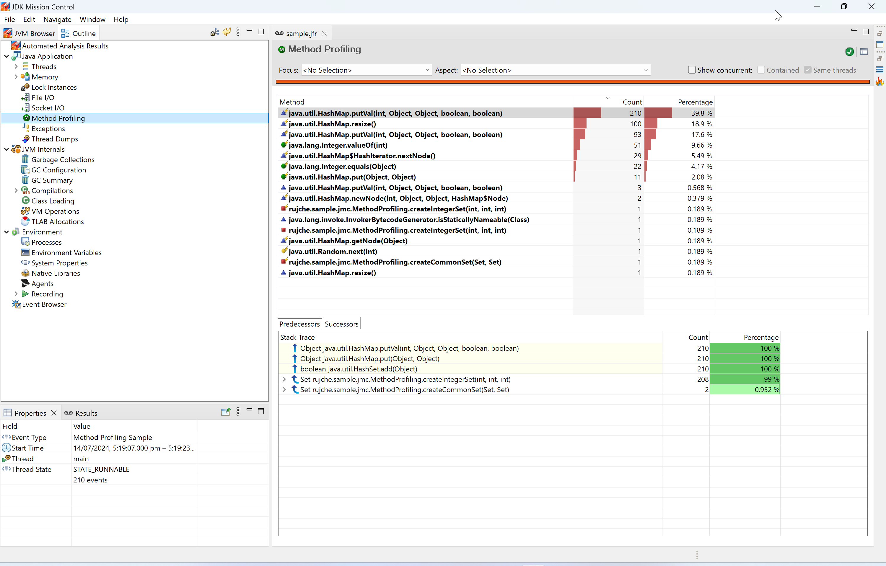
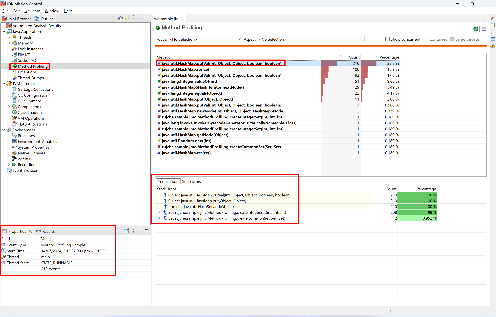
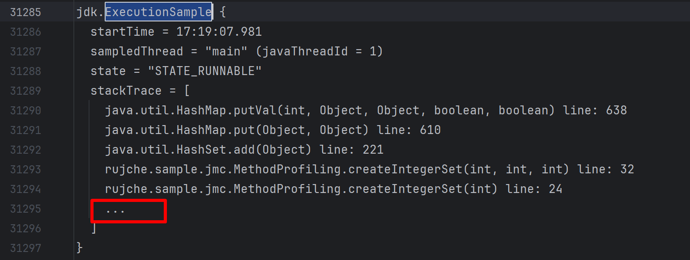
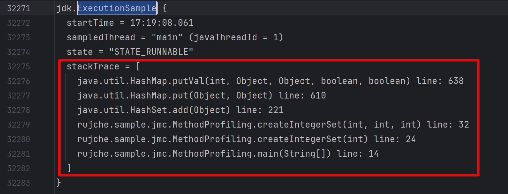
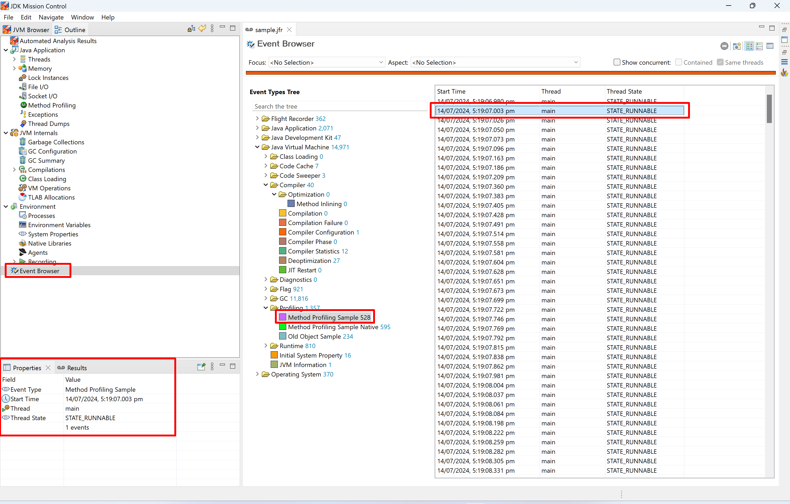
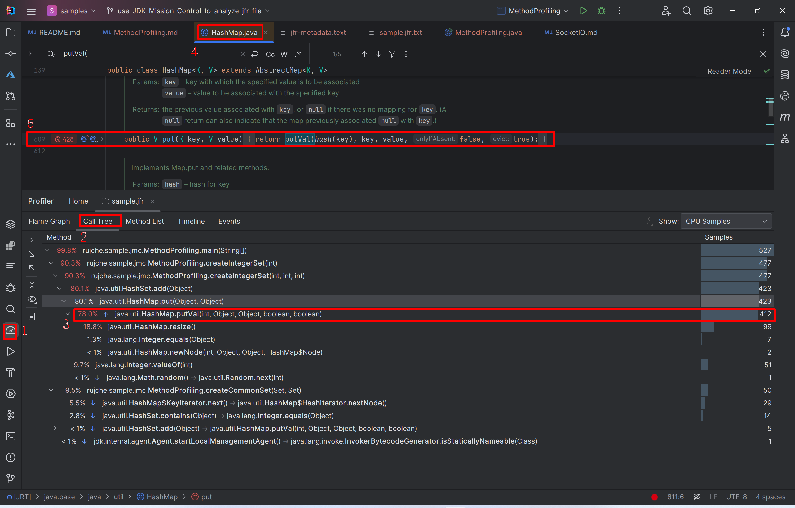
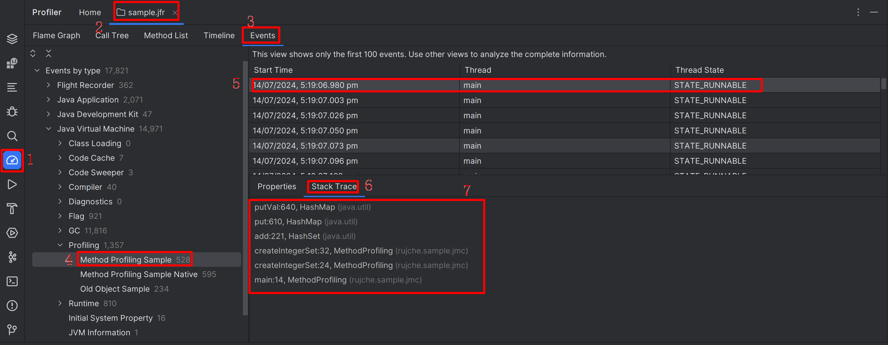
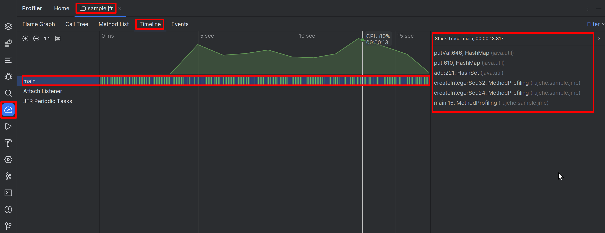
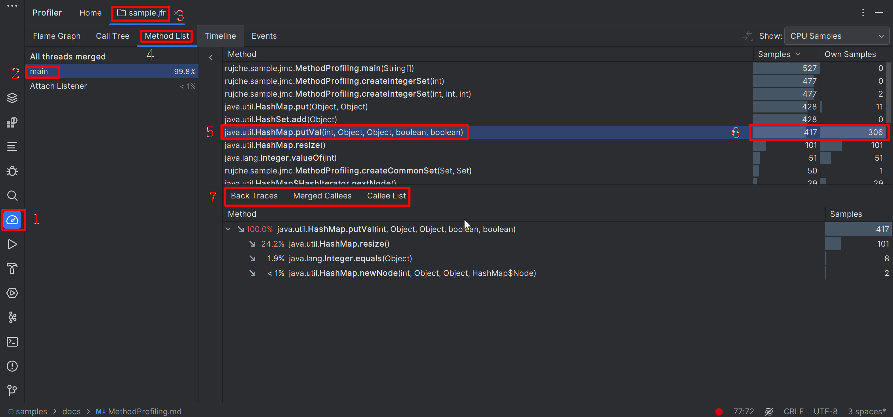
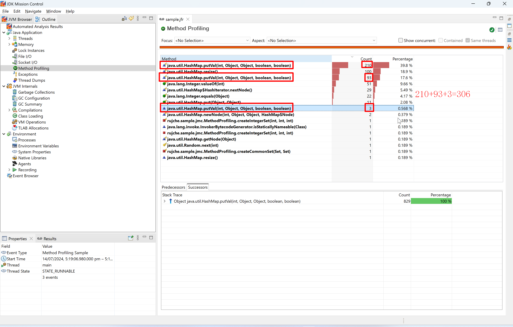

# Method Profiling

Just following the steps below one by one to learn about the basic usage of related feature in JMC.

1. Read the java code and think about the expected output.
    ```java
    public class MethodProfiling {
        private static final Logger LOGGER = LoggerFactory.getLogger(MethodProfiling.class);
    
        public static void main(String[] args) {
            LOGGER.info("main started.");
            Set<Integer> set1 = createIntegerSet(10_000_000);
            Set<Integer> set2 = createIntegerSet(10_000_000);
            Set<Integer> set3 = createIntegerSet(10_000_000);
            Set<Integer> common12 = createCommonSet(set1, set2);
            Set<Integer> common123 = createCommonSet(common12, set3);
            LOGGER.info("common123.size() = {}.", common123.size());
            LOGGER.info("main ended.");
        }
    
        private static Set<Integer> createIntegerSet(int size) {
            return createIntegerSet(0, size * 10, size);
        }
    
        private static Set<Integer> createIntegerSet(int x1, int x2, int size) {
            Set<Integer> result = new HashSet<>();
            while (result.size() < size) {
                double f = Math.random() / Math.nextDown(1.0);
                double x = x1 * (1.0 - f) + x2 * f;
                result.add((int) x);
            }
            return result;
        }
    
        private static Set<Integer> createCommonSet(Set<Integer> set1, Set<Integer> set2) {
            Set<Integer> result = new HashSet<>();
            for (Integer i : set1) {
                if (set2.contains(i)) {
                    result.add(i);
                }
            }
            return result;
        }
    }
    ```
2. Run above code with JVM parameter `-XX:StartFlightRecording=duration=30s,filename=sample.jfr`.
3. Check the log output:
    ```text
    [0.753s][info][jfr,startup] Started recording 1. The result will be written to:
    [0.753s][info][jfr,startup] 
    [0.753s][info][jfr,startup] C:\Users\rujche\Work\git-workspace\main\samples\sample.jfr
    17:19:06.899 [main] INFO rujche.sample.jmc.MethodProfiling -- main started.
    17:19:22.030 [main] INFO rujche.sample.jmc.MethodProfiling -- common123.size() = 100620.
    17:19:22.033 [main] INFO rujche.sample.jmc.MethodProfiling -- main ended.
    ```
4. Open `sample.jfr` by JMC. There is nothing specially related to Method Profiling.
   > 
5. Click `Method Profiling`. 
   > 
6. I tried to check the stacktrace in one `Method Profling Sample` event. I tried these methods:
   1. Use `Method Profling` page in JMC. But failed because lots of event are grouped into a bundle.
      > 
   2. Use `jfr print sample.jfr > sample.jfr.txt` and check the events. Some stacktrace are omitted.
      > 
   3. After investigation, I found this can be solved by adding parameter like this 
      `jfr print --stack-depth 100 sample.jfr > sample.jfr.txt`. The default depth is 5.
      > 
   4. Use `Events` page in JMC, it does not display the stacktrace.
      > 
7. Open `sample.jfr` by Intellij IDEA Ultimate directly. Open the `Call Tree`. It provides more useful information.
   1. It provides a `Call Tree`. It can display the sample number besides the method.
      > 
   2. It can display the stacktrace for a specific event.
      > 
   3. It can display the timeline of events.
      > 
   4. The `Method List` page provides more useful information than JMC.
      > 
      > 


