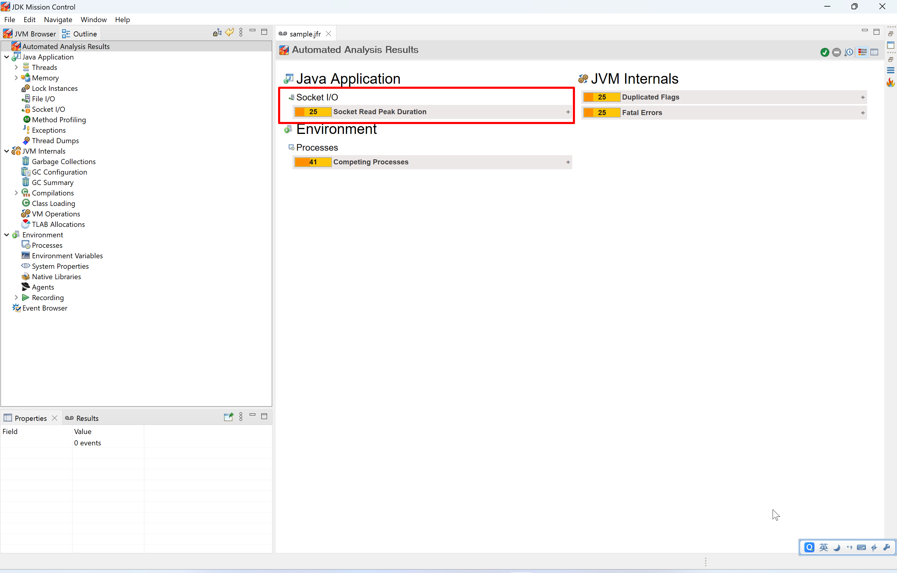
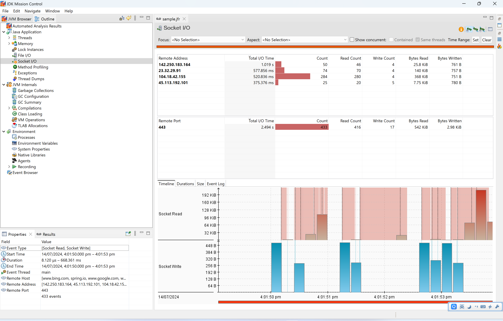

# Socket I/O

Just following the steps below one by one to learn about the basic usage of related feature in JMC.

1. Read the java code and think about the expected output.
    ```java
    public class SocketIOSample {
        private static final Logger LOGGER = LoggerFactory.getLogger(SocketIOSample.class);
    
        public static void main(String[] args) throws IOException {
            LOGGER.info("main started.");
            List<String> urlList = Arrays.asList(
                    "https://www.bing.com/",
                    "https://www.google.com/",
                    "https://www.baidu.com/",
                    "https://spring.io/"
            );
            for (String url : urlList) {
                String htmlPage = downloadFromUrl(url);
                LOGGER.info("Downloaded html page. url = {}, size = {} Bytes.", url, htmlPage.length());
            }
            LOGGER.info("main ended.");
        }
    
        private static String downloadFromUrl(String urlString) throws IOException {
            URL url = new URL(urlString);
            HttpURLConnection connection = (HttpURLConnection) url.openConnection();
            connection.setRequestMethod("GET");
            String result;
            try (BufferedReader reader = new BufferedReader(new InputStreamReader(connection.getInputStream()))) {
                StringBuilder builder = new StringBuilder();
                String line;
                while ((line = reader.readLine()) != null) {
                    builder.append(line);
                }
                result = builder.toString();
            }
            return result;
        }
    }
    ```
2. Run above code with JVM parameter `-XX:StartFlightRecording=duration=30s,filename=sample.jfr,jdk.SocketRead#threshold=0ns,jdk.SocketWrite#threshold=0ns`.
3. Check the log output:
    ```text
    [0.803s][info][jfr,startup] Started recording 1. The result will be written to:
    [0.803s][info][jfr,startup] 
    [0.803s][info][jfr,startup] C:\Users\rujche\Work\git-workspace\main\samples\sample.jfr
    16:01:49.321 [main] INFO rujche.sample.jmc.SocketIOSample -- main started.
    16:01:50.812 [main] INFO rujche.sample.jmc.SocketIOSample -- Downloaded html page. url = https://www.bing.com/, size = 136497 Bytes.
    16:01:52.057 [main] INFO rujche.sample.jmc.SocketIOSample -- Downloaded html page. url = https://www.google.com/, size = 20221 Bytes.
    16:01:52.668 [main] INFO rujche.sample.jmc.SocketIOSample -- Downloaded html page. url = https://www.baidu.com/, size = 2283 Bytes.
    16:01:53.359 [main] INFO rujche.sample.jmc.SocketIOSample -- Downloaded html page. url = https://spring.io/, size = 369227 Bytes.
    16:01:53.359 [main] INFO rujche.sample.jmc.SocketIOSample -- main ended.
    
    Process finished with exit code 0
    ```
4. Open `sample.jfr` by JMC.
   > 
5. The `Automated Analysis Results` already points out the problem: `Socket Read Peek Duration`.
6. Click `Socket I/O`.
   > 
7. Nothing special, just analyze 2 type of event (Socket Read, Socket Write) by different aspects.


