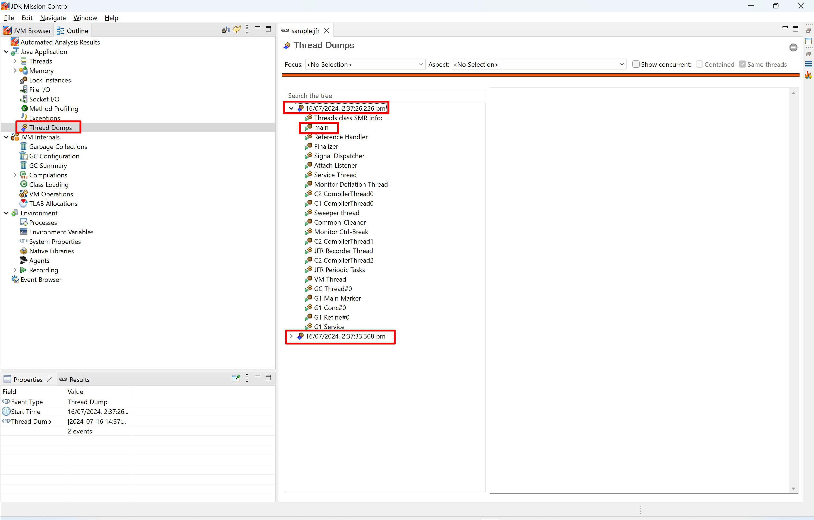
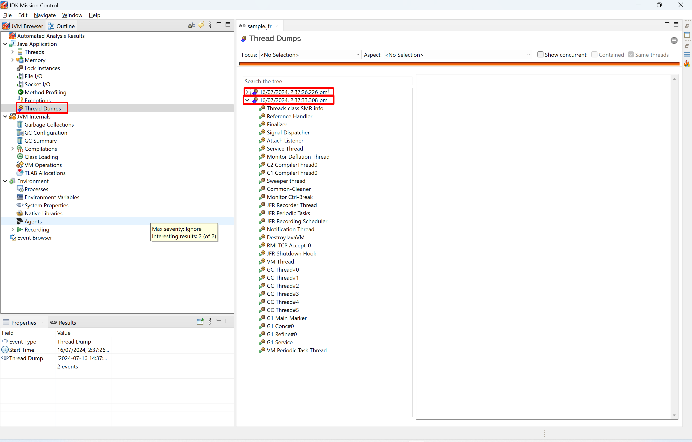
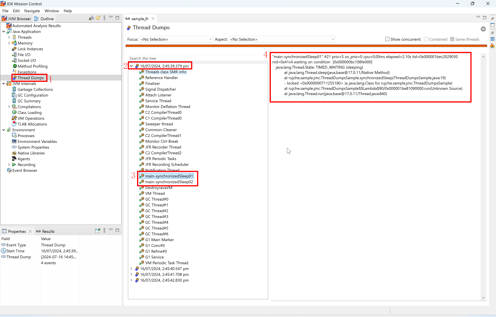

# Thread Dumps

1. Get to know thread dump related events.
    1. Print JFR metadata by this command:
        ```shell
        jfr metadata > jfr-metadata.text
        ```
    2. In `jfr-metadata.text`, search `thread` / `dump` to get related events.
        ```java
        @Name("jdk.ThreadDump")
        @Category({"Java Virtual Machine", "Runtime"})
        @Label("Thread Dump")
        class ThreadDump extends jdk.jfr.Event {
          @Label("Start Time")
          @Timestamp("TICKS")
          long startTime;
        
          @Label("Thread Dump")
          String result;
        }
        ```
2. Make sure related event are enabled. Search related event name in `${JAVA_HOME}/lib/jfr/default.jfc`.
    ```xml
        <event name="jdk.ThreadDump">
          <setting name="enabled" control="thread-dump-enabled">true</setting>
          <setting name="period" control="thread-dump">everyChunk</setting>
        </event>
    ```
3. The related event is enabled by default.
4. Whe period's value is `everyChunk`, what is `chunk` mean? I for answer from 
   [jfr command doc](https://docs.oracle.com/en/java/javase/22/docs/specs/man/jfr.html)
   1. Flight recording information is written in chunks.
   2. Use `jfr assemble` to assemble chunk files into a recording file.
   3. Use `jfr disassemble` to decompose a flight recording file into its chunk file pieces.
5. Read the java code and think about the expected output.
    ```java
    public class ThreadDumpsSample {
        private static final Logger LOGGER = LoggerFactory.getLogger(ThreadDumpsSample.class);
    
        public static void main(String[] args) {
            LOGGER.info("main started.");
            new Thread(ThreadDumpsSample::synchronizedSleep, "main-synchronizedSleep01").start();
            new Thread(ThreadDumpsSample::synchronizedSleep, "main-synchronizedSleep02").start();
            LOGGER.info("main ended.");
        }
    
        private static synchronized void synchronizedSleep() {
            LOGGER.info("synchronizedSleep started.");
            try {
                Thread.sleep(3_000);
            } catch (InterruptedException e) {
                throw new RuntimeException(e);
            }
            LOGGER.info("synchronizedSleep ended.");
        }
    }
    ```
6. Run the code with JVM parameter `-XX:StartFlightRecording=duration=30s,filename=sample.jfr`.
7. Open `sample.jfr` by JMC. Click `Thread Dumps`.
   > 
   > 
8. Analyze the thread dump.
   1. There are 2 thread dumps. Seems there are 2 chunks.
   2. The only thread created by above code is `main`.
9. To analyze the threads created by above code, re-run code by JVM parameter 
   `-XX:StartFlightRecording=duration=30s,filename=sample.jfr,jdk.ThreadDump#period=1s`
10. Check the console output.
   ```text
   [0.794s][info][jfr,startup] Started recording 1. The result will be written to:
   [0.794s][info][jfr,startup] 
   [0.794s][info][jfr,startup] C:\Users\rujche\Work\git-workspace\main\samples\sample.jfr
   14:45:37.012 [main] INFO rujche.sample.jmc.ThreadDumpsSample -- main started.
   14:45:37.016 [main-synchronizedSleep01] INFO rujche.sample.jmc.ThreadDumpsSample -- synchronizedSleep started.
   14:45:37.016 [main] INFO rujche.sample.jmc.ThreadDumpsSample -- main ended.
   14:45:40.018 [main-synchronizedSleep01] INFO rujche.sample.jmc.ThreadDumpsSample -- synchronizedSleep ended.
   14:45:40.018 [main-synchronizedSleep02] INFO rujche.sample.jmc.ThreadDumpsSample -- synchronizedSleep started.
   14:45:43.026 [main-synchronizedSleep02] INFO rujche.sample.jmc.ThreadDumpsSample -- synchronizedSleep ended.
   
   Process finished with exit code 0
   ```
11. Open the new `sample.jfr` by JMC. Click `Thread Dumps`.
    > 
12. Analyze the thread dump
    1. There are 4 thread dumps. It dumps every 1 second as expected.
    2. The first thread dump happened at second of 39, from above console log, the main ended ar second of 37. So the 
       main thread hadn't been captured in the thread dump. Seems the thread dump need some time to prepare.
    3. The `main-synchronizedSleep01` adn `main-synchronizedSleep02` thread are captured in the thread dump. One is 
       sleeping, and another one is waiting as expected.
13. Use the following command to print related event to text file
    ```shell
    jfr print --events jdk.ThreadDump sample.jfr > sample.jfr.jdk.ThreadDump.text
    ```
14. Open `sample.jfr.jdk.ThreadDump.text` and found nothing special. JMC just provide a list of thread dumps, and the
    list help us easier to find and view the thread dump we care about.

