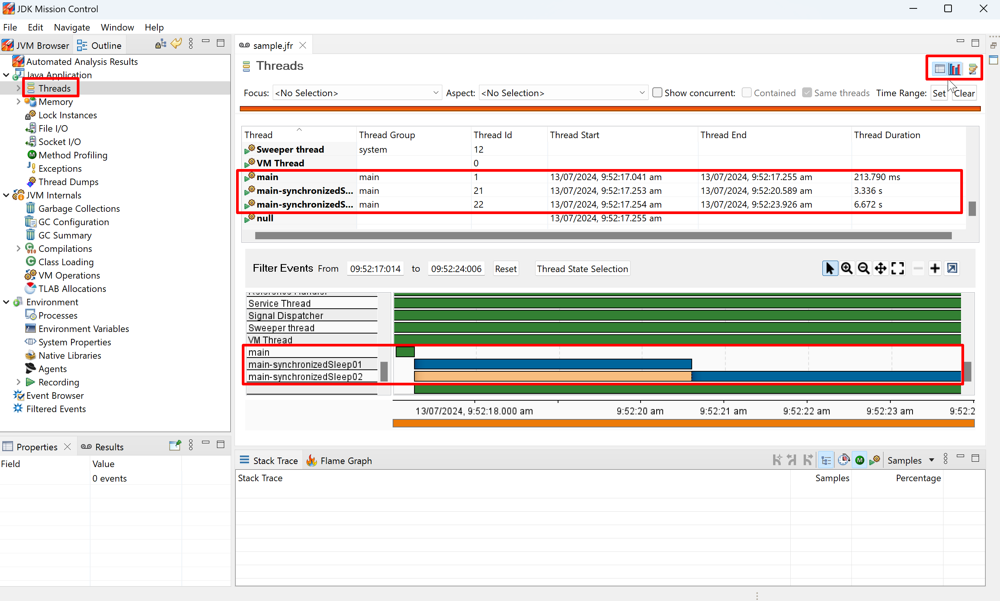

# Threads

Just following the steps below one by one to learn about the basic usage of related feature in JMC.

1. Read the java code and think about the expected output.
    ```java
    public class ThreadsSample {
        private static final Logger LOGGER = LoggerFactory.getLogger(ThreadsSample.class);
    
        public static void main(String[] args) {
            LOGGER.info("main started.");
            new Thread(ThreadsSample::synchronizedSleep, "main-synchronizedSleep01").start();
            new Thread(ThreadsSample::synchronizedSleep, "main-synchronizedSleep02").start();
            LOGGER.info("main ended.");
        }
    
        private static synchronized void synchronizedSleep() {
            LOGGER.info("synchronizedSleep started.");
            try {
                Thread.sleep(3_000);
            } catch (InterruptedException e) {
                throw new RuntimeException(e);
            }
            LOGGER.info("synchronizedSleep ended.");
        }
    }
    ```
2. Run the code with JVM parameter `-XX:StartFlightRecording=duration=30s,filename=sample.jfr`.
3. Check the output log. Does it meet with your expectation? Here is the log in my side:
   ```text
   [0.813s][info][jfr,startup] Started recording 1. The result will be written to:
   [0.813s][info][jfr,startup] 
   [0.813s][info][jfr,startup] C:\Users\rujche\Work\git-workspace\main\samples\sample.jfr
   09:52:17.222 [main] INFO rujche.sample.jmc.ThreadsSample -- main started.
   09:52:17.228 [main-synchronizedSleep01] INFO rujche.sample.jmc.ThreadsSample -- synchronizedSleep started.
   09:52:17.228 [main] INFO rujche.sample.jmc.ThreadsSample -- main ended.
   09:52:20.229 [main-synchronizedSleep01] INFO rujche.sample.jmc.ThreadsSample -- synchronizedSleep ended.
   09:52:20.229 [main-synchronizedSleep02] INFO rujche.sample.jmc.ThreadsSample -- synchronizedSleep started.
   09:52:23.230 [main-synchronizedSleep02] INFO rujche.sample.jmc.ThreadsSample -- synchronizedSleep ended.
   ```
4. JFR file is binary file, it's not readable directly. But we can print jfr file contents to text file by jfr tool in 
   JDK. The jfr tool is part of the JDK installation. 
   ```shell
   $ jfr print sample.jfr > sample.jfr.txt
   ```
5. Open sample.jfr.text, we can find that the content is just a list of events.
   ```text
   jdk.ActiveSetting {
     startTime = 09:52:17.014
     id = 1538
     name = "threshold"
     value = "0 ns"
     eventThread = "main" (javaThreadId = 1)
   }
   
   jdk.ActiveSetting {
     startTime = 09:52:17.014
     duration = 0.539 ms
     id = 1538
     name = "stackTrace"
     value = "false"
     eventThread = "main" (javaThreadId = 1)
   }
   ...
   ```
6. The events and their field layout depends on the JDK version. We can use the `jfr` tool to look at the metadata:
   ```shell
   jfr metadata > jfr-metadata.text
   ```
7. Open `jfr-metadata.text`, and find the event we have seen before: `jdk.ActiveSetting`.
   ```java
   @Name("jdk.ActiveSetting")
   @Label("Recording Setting")
   @Category("Flight Recorder")
   class ActiveSetting extends jdk.jfr.Event {
     @Label("Start Time")
     @Timestamp("TICKS")
     long startTime;
   
     @Label("Duration")
     @Timespan("TICKS")
     long duration;
   
     @Label("Event Thread")
     @Description("Thread in which event was committed in")
     Thread eventThread;
   
     @Label("Stack Trace")
     @Description("Stack Trace starting from the method the event was committed in")
     StackTrace stackTrace;
   
     @Label("Event Id")
     long id;
   
     @Label("Setting Name")
     String name;
   
     @Label("Setting Value")
     String value;
   }
   ```
8. Open `sample.jfr` by JMC.
   > 
9. The `Automated Analysis Result` was displayed by default. The given result is accurate: `Lock Instance` / 
   `Java Blocking`.
10. Click `Threads` and analyze by the board.
   > 
11. Choose one thread and analyze it.
   > 
12. Find related event in sample.jfr. 
    1. For example, to find this event: 
       > 
    2. Search `Java Monitor Blocked` in `jfr-metadata.text`, get `JavaMonitorEnter`:
       > 
    3. Search `JavaMonitorEnter` in `sample.jfr.text`:
       > 
13. Find related event in JMC page.
    > 

