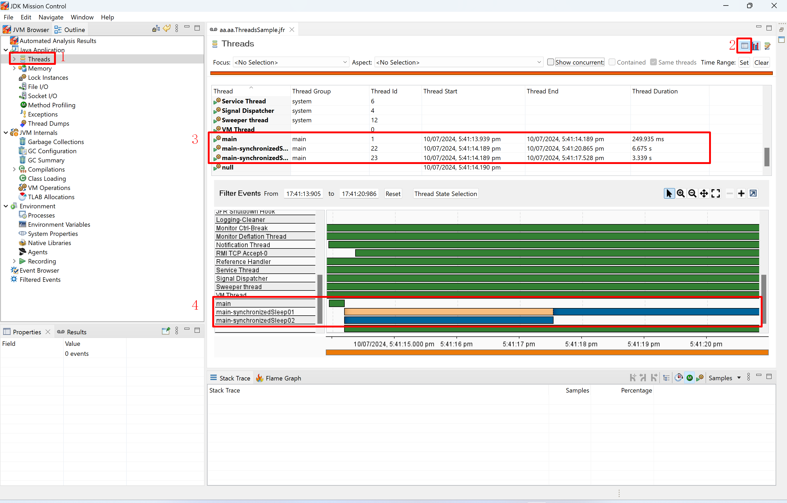
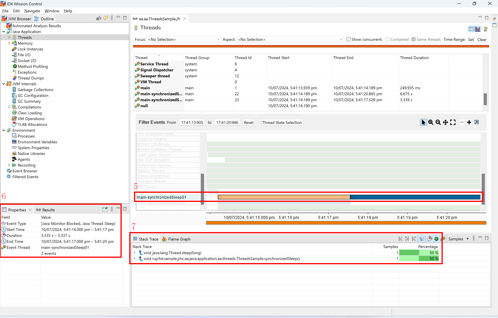
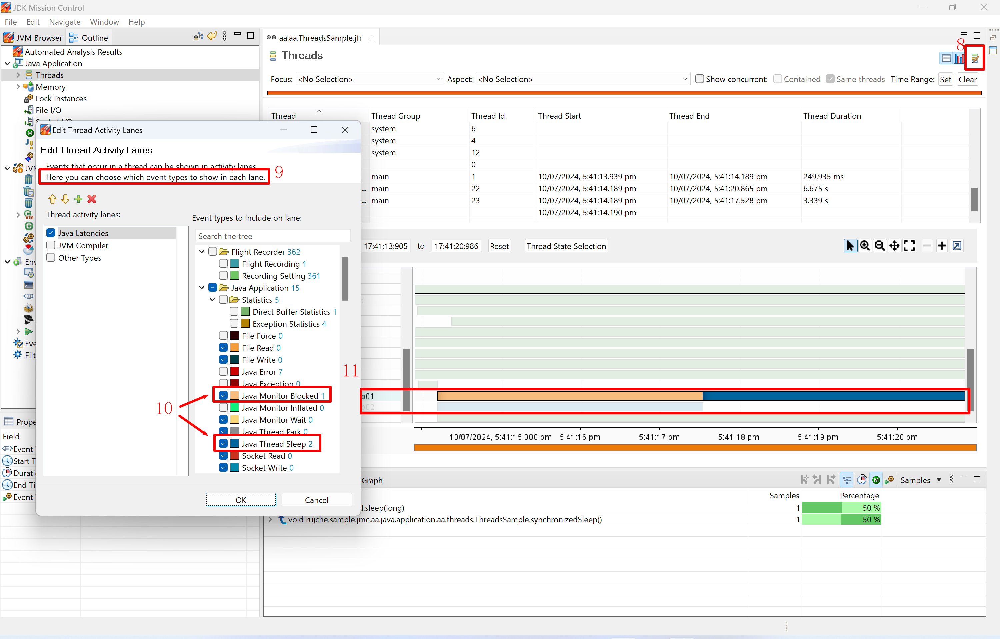
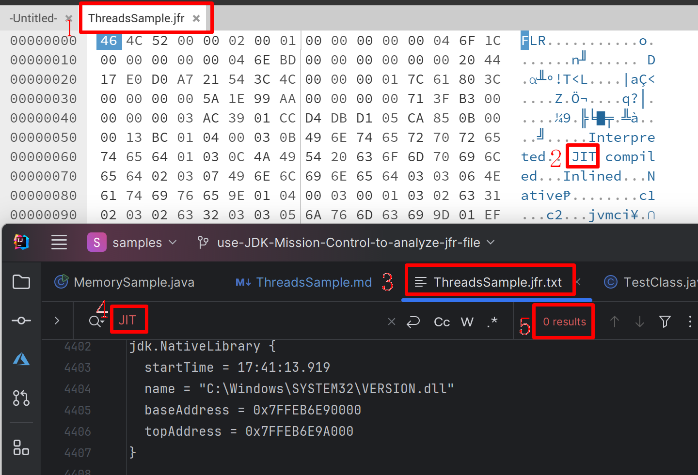
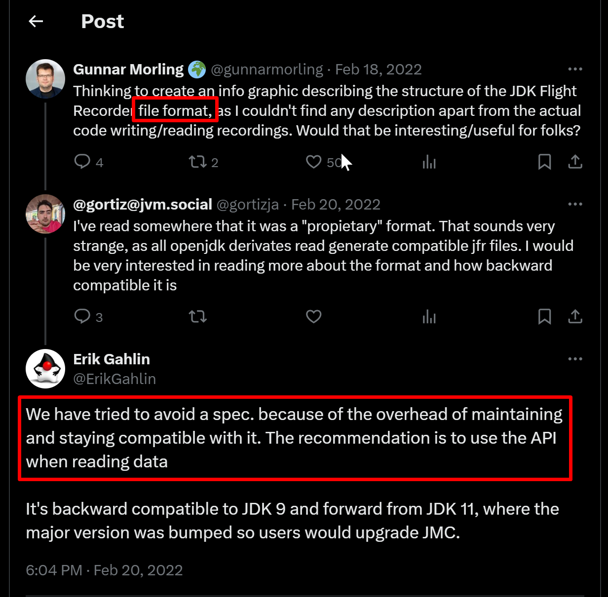
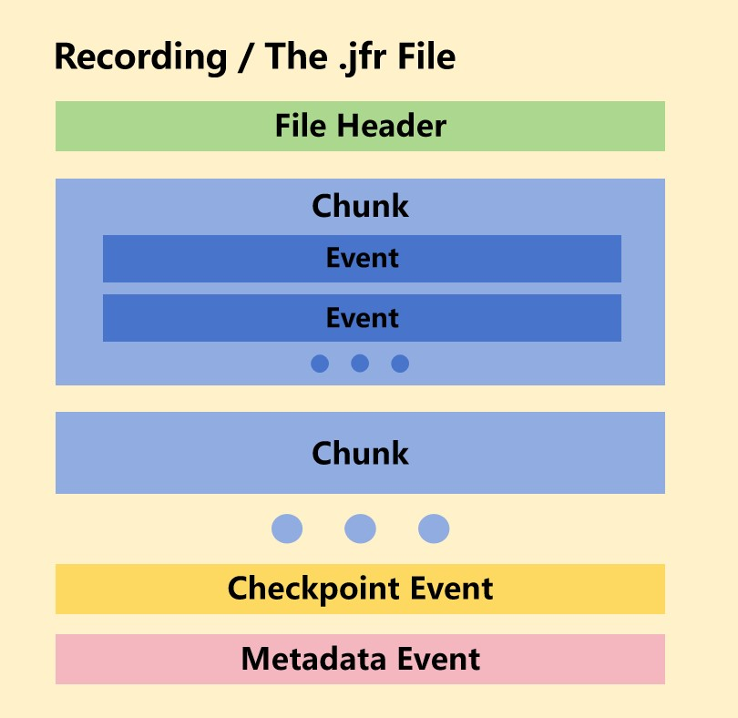

### Thread

1. Click `Threads` to display threads related content.
   > 
2. Click `Show table` to show Threads table.
3. Check the 3 related threads in the table.
   1. The start time and end time is same as expected.
4. Check the 3 related threads in the chart.
   1. When the thread is running, it's color is green.
   2. When the thread is blocked or sleep. it has different color.
   3. The `main-synchronizedSleep01` thread start before `main-synchronizedSleep02`, 
      but the `main-synchronizedSleep02` get the lock first.
   4. The `main` thread ends before the 2 threads start.
   > 
5. Click `main-synchronizedSleep001` to show more information.
6. There a 2 event types: `Java Monitor Blocked` and `Java Thread Sleep`.
7. There are 2 Samples in the thread.
   > 
8. Click `Edit Thread Lanes` icon.
9. Here you can choose which event types to show in each lane.
10. `Java Monitor Blocked` event `Java Thread Sleep` event are selected to ben shown.
11. The event count and event color are same as expected.
12. Print jfr file contents to text file.
   ```shell
   $ which jfr
   /c/Program Files/Microsoft/jdk-17.0.11.9-hotspot/bin/jfr
   $ jfr print ./src/main/java/rujche/sample/jmc/aa/java/application/aa/threads/ThreadsSample.jfr > ThreadsSample.jfr.txt
   ```
13. Check the text file context.
   ```text
   jdk.Deoptimization {
     startTime = 17:41:13.905
     compileId = 1193
     compiler = "c2"
     method = java.util.ArrayList.grow(int)
     lineNumber = 233
     bci = 17
     instruction = "if_acmpeq"
     reason = "unstable_if"
     action = "reinterpret"
     eventThread = "Attach Listener" (javaThreadId = 5)
   }
   
   jdk.ActiveSetting {
     startTime = 17:41:13.906
     id = 1538
     name = "threshold"
     value = "0 ns"
     eventThread = "main" (javaThreadId = 1)
   }
   ...
   ```
14. I got it: jfr files are just a list of event records. Use jfr (binary) format instead of text format to save 
    time and save space.
15. Compare jfr file and text file. jfrFileSize / textFileSize = 290588 / 803627 = 0.37.
16. Get summary of a jfr file.
   ```shell
   $ jfr summary ./src/main/java/rujche/sample/jmc/aa/java/application/aa/threads/ThreadsSample.jfr > ThreadsSample.jfr.summary.txt
   ```
17. Take a look about the summary file.
   ```text
   
    Version: 2.1
    Chunks: 1
    Start: 2024-07-10 09:41:13 (UTC)
    Duration: 6 s
   
    Event Type                                   Count  Size (bytes) 
   ==================================================================
    jdk.BooleanFlag                                526         15557
    jdk.ModuleExport                               503          4854
    jdk.ActiveSetting                              361         11137
    ...
    jdk.ThreadSleep                                  2            32
    ...
   ```
18. We can see that there are 2 jdk.ThreadSleep events, it's same to out expectation.
19. About jfr file size. 

    |             | 30 seconds) | 1 second    | 1 Minute | 1 hour      |
    |-------------|-------------|-------------|----------|-------------|
    | File Size   | 284 (KB)    | **10 (KB)** | 600 (KB) | **35 (MB)** |
    | Event Count | 4890        | **160**     | 10,000   | 600,000     |
    1. fileSizeForOneEvent = 290588 / 4890 = 59 (Byte / Event). 
    2. If it's text format, fileSizeForOneEvent = 20 (Byte / line) * 10 (line) = 200 (Byte), about 3 times bigger than 
       jfr file. Just same as before.
    3. What will happen if File Size for 1 hour is 35 GB?
    4. We can use command `-XX:StartFlightRecording:maxsize=50MB,maxage=1h` to set max size and max age. The default 
       max size is 250 MB, there is no default value of max age.
20. jfr file just contains a list of events, and all its content can be converted into text file by `jfr print`. Is that 
    true? To give the answer to this question, I did some more investigation. 
    1. Open the jfr file by hex editor (Here is a hex editor online: https://hexed.it/), I found some string contained 
       in the .jfr file, but not included in the .jfr.text. Seems some information lost from .jfr file to .jfr.text file.
       > 
    2. After short-time investigation, I found a [related post](https://x.com/ErikGahlin/status/1495338682651402242) in x.com:
       > 
    3. Someone [analyzed the jfr file format](http://www.beet.asia/2023/10/24/JavaFlightRecorderFileFormat/) by reading 
       the [source code of JMC](https://github.com/openjdk/jmc/tree/0d8b09d602f306f65f577ccda8ef2abe120cf738/core/org.openjdk.jmc.flightrecorder.writer) 
       and give the diagram of jfr file format:
       > 
21. Some conclusions about jfr file:
    1. jfr is short for Java Flight Record.
    2. jfr file contains detailed low-level information about how a JVM and Java applications are behaving.
    3. jfr file is hex file, not text file.
    4. The mainly content in jfr file are events.
    5. `jfr print` can be used to print contents of a jfr file.
    6. There is no spec for the jfr file format. The best way to analyze a jfr file is using JMC.
